# O'ZBEKISTON RESPUBLIKASI OLIY TA'LIM, FAN VA INNOVATSIYALAR VAZIRLIGI

### \_\_\_\_\_\_\_\_\_\_\_\_\_\_\_\_\_\_\_\_\_\_\_\_\_\_\_\_\_\_\_\_\_\_\_\_\_\_\_\_\_ UNIVERSITETI

#### \_\_\_\_\_\_\_\_\_\_\_\_\_\_\_\_\_\_\_\_\_\_\_\_\_\_\_ fakulteti

#### "\_\_\_\_\_\_\_\_\_\_\_\_\_\_\_\_\_\_\_\_\_\_\_\_\_\_\_" kafedrasi

<br><br>

#### "Himoyaga ruxsat etiladi"

Kafedra mudiri: \_\_\_\_\_\_\_\_\_\_\_\_\_\_\_\_\_

"\_\_\_\_" \_\_\_\_\_\_\_\_\_\_\_\_\_\_ 20\_\_ yil

<br><br><br>

# BITIRUV MALAKAVIY ISHI

## Mavzu: "ADABIYOTLAR ALMASHINUVI (BOOKCROSSING) UCHUN INTELLEKTUAL AXBOROT-QIDIRUV VEB-PLATFORMASINI ISHLAB CHIQISH"

<br><br><br>

| | |
|---|---|
| **Bajaruvchi:** | \_\_\_\_\_\_\_\_\_\_\_\_\_\_\_\_\_\_\_\_\_\_\_\_\_\_ |
| **Ta'lim yo'nalishi:** | 5330300 — Axborot tizimlari va texnologiyalari |
| **Ilmiy rahbar:** | \_\_\_\_\_\_\_\_\_\_\_\_\_\_\_\_\_\_\_\_\_\_\_\_\_\_ |
| **Taqrizchi:** | \_\_\_\_\_\_\_\_\_\_\_\_\_\_\_\_\_\_\_\_\_\_\_\_\_\_ |

<br><br><br>

#### Toshkent — 20\_\_

---

# MUNDARIJA

**KIRISH** ......................................................................................................... 3

**I BOB. ADABIYOTLAR ALMASHINUVI VA AXBOROT-QIDIRUV TIZIMLARINING NAZARIY ASOSLARI** ......................................................................... 7

1.1. Kitobxonlikni va adabiyotlar almashinuvini (Bookcrossing) raqamlashtirishning bugungi holati va muammolari ...................................................................... 7

1.2. Intellektual axborot-qidiruv tizimlari va ularning veb-platformalardagi o'rni ...... 14

1.3. Mavjud muqobil platformalar tahlili va ishlab chiqilayotgan tizimning afzalliklari ... 21

**II BOB. PLATFORMANING INTELLEKTUAL ALGORITMLARI VA ARXITEKTURASINI LOYIHALASH** ............................................................................. 29

2.1. Veb-platformaning funksional va texnik talablarini loyihalash ...................... 29

2.2. Axborot-qidiruv va adabiyotlarni tavsiya qilishning intellektual modellari .......... 37

2.3. Kitob almashinuvini rag'batlantirish (gamifikatsiya) va ma'lumotlar bazasi tuzilishi ... 45

**III BOB. INTELLEKTUAL VEB-PLATFORMANI DASTURIY AMALGA OSHIRISH VA SINASH** ............................................................................................ 53

3.1. Dasturlash texnologiyalari va backend/frontend qismini ishlab chiqish ............. 53

3.2. Platformaning foydalanuvchi interfeysi (UI/UX) va shaxsiy kabinet funksionalini yaratish ... 61

3.3. Tizimni testlash va olingan natijalar tahlili ...................................... 68

**IV BOB. HAYOT FAOLIYATI XAVFSIZLIGI VA IQTISODIY SAMARADORLIK HISOBLARI** ......................................................................... 75

4.1. Kompyuter texnikasidan foydalanishda mehnat gigienasi va xavfsizlik texnikasi talablari ... 75

4.2. Loyihani ishlab chiqish va joriy etishning iqtisodiy samaradorligi hisobi ........... 81

**XULOSA** ....................................................................................................... 88

**FOYDALANILGAN ADABIYOTLAR RO'YXATI** .................................................. 91

**ILOVALAR** ................................................................................................... 94

---

# QISQARTMA VA ATAMALAR RO'YXATI

| Qisqartma | To'liq nomi (inglizcha) | Izoh |
|---|---|---|
| API | Application Programming Interface | Dasturlar o'zaro ta'sir interfeysi |
| BCID | BookCrossing ID | Kitobning noyob identifikatori |
| CF | Collaborative Filtering | Kollaborativ filtrlash |
| CRUD | Create, Read, Update, Delete | Asosiy ma'lumotlar amallari |
| DRF | Django REST Framework | Backend freymvorki |
| ER | Entity-Relationship | Mohiyat-munosabat modeli |
| IR | Information Retrieval | Axborot-qidiruv |
| IRS | Information Retrieval System | Axborot-qidiruv tizimi |
| JWT | JSON Web Token | Autentifikatsiya tokeni |
| ML | Machine Learning | Mashina o'rganish |
| NFT | Non-Functional Requirement | Nofunksional talab |
| NLP | Natural Language Processing | Tabiiy tilni qayta ishlash |
| ORM | Object-Relational Mapping | Ob'ekt-relyatsion bog'lash |
| REST | Representational State Transfer | Veb-API arxitektura uslubi |
| ROI | Return on Investment | Investitsiya rentabelligi |
| TF-IDF | Term Frequency – Inverse Document Frequency | So'z vaznlash usuli |
| UI/UX | User Interface / User Experience | Foydalanuvchi interfeysi/tajribasi |
| UML | Unified Modeling Language | Yagona modellashtirish tili |
| SWOT | Strengths, Weaknesses, Opportunities, Threats | Strategik tahlil usuli |

---

# RASMLAR RO'YXATI

1.1-rasm. Kitobxonlik va an'anaviy bookcrossing tizimining umumiy zanjiri
1.2-rasm. Mavjud onlayn kitob almashish tizimlarida jarayonlarning kechishi
1.3-rasm. Raqamlashtirish darajasining statistik tahlili
1.4-rasm. Axborot-qidiruv tizimining umumiy ishlash prinsipi
1.5-rasm. Oddiy va intellektual qidiruv tizimlarining solishtirma sxemasi
1.6-rasm. Veb-platformalarda indekslash va qidirish jarayoni oqimi
1.7-rasm. Yetakchi platformalarning interfeys tahlili
1.8-rasm. Muqobil tizimlarning SWOT tahlil chizmasi
1.9-rasm. Platformaning konseptual farqlari va yangiliklari sxemasi
2.1-rasm. Platformaning umumiy me'moriy arxitekturasi
2.2-rasm. UML Use Case diagrammasi
2.3-rasm. Kitob almashish jarayonining UML Sequence diagrammasi
2.4-rasm. Intellektual saralash algoritmi blok-sxemasi
2.5-rasm. Collaborative Filtering modelining mantiqiy tuzilishi
2.6-rasm. Foydalanuvchi qiziqishlari matritsasi sxemasi
2.7-rasm. Gamifikatsiya mexanizmi algoritmik oqimi
2.8-rasm. Ma'lumotlar bazasining ER konseptual modeli
2.9-rasm. Ma'lumotlar bazasi relyatsion sxemasi
3.1-rasm. Texnologiyalar steki va o'zaro bog'lanishi
3.2-rasm. Backend qismining umumiy tuzilishi
3.3-rasm. Ma'lumotlar bazasiga so'rovlar moduli strukturasi
3.4-rasm. Bosh sahifa interfeysi dizayn maketi
3.5-rasm. Intellektual qidiruv va filtrlar sahifasi
3.6-rasm. Shaxsiy kabinet interfeysi
3.7-rasm. Funksional testlash natijalari
3.8-rasm. Yuklama testlash grafiklari
3.9-rasm. Qidiruv va tavsiya tizimi aniqligi grafigi
4.1-rasm. Ergonomika qoidalari sxemasi
4.2-rasm. Yoritilganlik va xavfsiz masofalar chizmasi
4.3-rasm. Yong'in va elektr xavfsizligi joylashuv sxemasi
4.4-rasm. Loyiha Gantt diagrammasi
4.5-rasm. Loyiha xarajatlari tarkibi diagrammasi
4.6-rasm. Iqtisodiy samaradorlik va o'zini oqlash grafigi

---

# JADVALLAR RO'YXATI

1-jadval. Loyihani ishlab chiqish xarajatlari smetasi
2-jadval. Yillik eksplutatsion xarajatlar va daromad prognozi
3-jadval. Bosqichlar bo'yicha mehnat sarfi
4-jadval. Asosiy iqtisodiy ko'rsatkichlar jamlanmasi

---

# KIRISH

**Mavzuning dolzarbligi.** Hozirgi raqamli transformatsiya davrida insoniyat bilim va ma'lumotlarni uzatish, saqlash hamda almashishning butunlay yangi shakllariga o'tib bormoqda. Shunga qaramay, bosma kitob va an'anaviy o'qish madaniyati o'zining ijtimoiy, ma'rifiy va emotsional ahamiyatini yo'qotgani yo'q. Aksincha, ko'plab mamlakatlarda "qayta o'qish iqtisodiyoti" (reuse economy) va resurslarni oqilona qayta ishlatish g'oyalari kuchayishi bilan, o'qib bo'lingan kitoblarni boshqalarga uzatish — ya'ni **bookcrossing** (kitoblar almashinuvi) harakati yangi quvvat bilan rivojlanmoqda.

Bookcrossing — bu kitobni o'qib bo'lgach, uni jamoat joyiga qoldirish yoki boshqa kitobxonga uzatish orqali "erkin sayohatga" yuborish g'oyasiga asoslangan global ijtimoiy harakatdir. An'anaviy bookcrossing katta hududiy cheklovlarga, kitobni izlash va topishdagi tasodifiylikka, hamda ishtirokchilar o'rtasidagi aloqaning zaifligiga duch keladi. Aynan shu muammolar bugungi kunda **intellektual axborot-qidiruv texnologiyalari** va **veb-platformalar** yordamida hal etilishi mumkin.

O'zbekiston Respublikasida kitobxonlik madaniyatini yuksaltirish davlat siyosatining ustuvor yo'nalishlaridan biriga aylangan. Yoshlar o'rtasida ma'naviy-ma'rifiy ishlarni kuchaytirish, kitob mutolaasini ommalashtirish, raqamli kutubxonalar va onlayn ta'lim resurslarini rivojlantirish bo'yicha bir qator chora-tadbirlar amalga oshirilmoqda. Shu nuqtai nazardan, kitobxonlarni yagona raqamli makonda birlashtiruvchi, ularga kerakli adabiyotni tez topishga, o'zaro almashishga va yangi kitoblar bilan tanishishga yordam beruvchi intellektual platforma yaratish dolzarb vazifa hisoblanadi.

Zamonaviy foydalanuvchi katta hajmdagi ma'lumotlar oqimi sharoitida oddiy kalit so'z bo'yicha qidiruv natijalaridan qoniqmaydi. Unga **semantik (mazmunga asoslangan) qidiruv**, shaxsiy qiziqishlarига moslashtirilgan **tavsiya tizimlari (recommender systems)** va qulay foydalanuvchi tajribasi (UX) kerak. Mashina o'rganish (Machine Learning) va kollaborativ filtrlash (Collaborative Filtering) algoritmlari aynan shunday intellektual xizmatlarni taqdim etish imkonini beradi. Bularning barchasi mazkur bitiruv malakaviy ishi mavzusining dolzarbligini belgilaydi.

**Muammoning o'rganilganlik darajasi.** Bookcrossing harakati dunyoda 2001-yildan beri rivojlanib kelmoqda (BookCrossing.com loyihasi). Kitob almashish va kitobxonlar ijtimoiy tarmoqlari sohasida Goodreads, LibraryThing, BookMooch kabi xalqaro platformalar mavjud. Axborot-qidiruv tizimlari (Information Retrieval), semantik qidiruv va tavsiya tizimlari nazariyasi G. Salton, C. Manning, F. Ricci kabi olimlar asarlarida chuqur yoritilgan. Biroq, milliy sharoitda, o'zbek tilidagi kontentni qo'llab-quvvatlovchi, intellektual qidiruv, tavsiya va gamifikatsiya elementlarini birlashtirgan yaxlit bookcrossing platformasi yetarlicha ishlab chiqilmagan. Bu esa mazkur ishning ilmiy-amaliy bo'shliqni to'ldirishga qaratilganligini ko'rsatadi.

**Bitiruv malakaviy ishining maqsadi** — adabiyotlar almashinuvini (bookcrossing) raqamlashtirish, kitobxonlarni yagona raqamli muhitda birlashtirish va ularга kerakli kitobni topishni intellektual qidiruv hamda tavsiya algoritmlari yordamida osonlashtiruvchi veb-platformani loyihalash va dasturiy amalga oshirishdan iborat.

**Ishning vazifalari.** Belgilangan maqsadga erishish uchun quyidagi vazifalar hal etildi:

1. Kitobxonlik va bookcrossing harakatini raqamlashtirishning hozirgi holati, muammolari va imkoniyatlarini tahlil qilish;
2. Intellektual axborot-qidiruv tizimlarining nazariy asoslari va veb-platformalardagi o'rnini o'rganish;
3. Mavjud muqobil platformalarni (BookCrossing.com, Goodreads va boshqalar) qiyosiy tahlil qilish hamda ishlab chiqilayotgan tizimning afzalliklarini asoslash;
4. Platformaning funksional va texnik talablarini shakllantirish, me'moriy arxitekturasini loyihalash;
5. Intellektual qidiruv va kitoblarni tavsiya qilish (Collaborative Filtering) modellarini ishlab chiqish;
6. Foydalanuvchilarni rag'batlantirish (gamifikatsiya) mexanizmi va ma'lumotlar bazasi tuzilmasini loyihalash;
7. Tizimning backend va frontend qismlarini dasturiy amalga oshirish;
8. Tizimni funksional va yuklama (load) testlaridan o'tkazish, natijalarni tahlil qilish;
9. Mehnat xavfsizligi va iqtisodiy samaradorlik masalalarini hisoblash.

**Tadqiqot obyekti** — adabiyotlar almashinuvi (bookcrossing) jarayonlari va kitobxonlar o'rtasidagi axborot almashinuvi.

**Tadqiqot predmeti** — intellektual axborot-qidiruv va tavsiya algoritmlariga asoslangan bookcrossing veb-platformasini loyihalash va ishlab chiqish usullari.

**Tadqiqot usullari.** Ishda tizimli tahlil, ob'ektga yo'naltirilgan loyihalash (UML), ma'lumotlar bazasini modellashtirish (ER-modellashtirish), axborot-qidiruv nazariyasi (vektor fazo modeli, TF-IDF), mashina o'rganishning kollaborativ filtrlash usullari, hamda dasturiy ta'minotni testlash metodlari qo'llanildi.

**Ishning ilmiy yangiligi va amaliy ahamiyati:**
- O'zbek tilidagi kontentni qo'llab-quvvatlovchi, semantik qidiruv va tavsiya tizimini birlashtirgan bookcrossing platformasining konseptual modeli ishlab chiqildi;
- Kitoblarni kalit so'zlar va teglar bo'yicha intellektual saralash hamda foydalanuvchilarga shaxsiylashtirilgan tavsiya berish algoritmlari taklif etildi;
- Kitob almashinuvini rag'batlantiruvchi gamifikatsiya mexanizmi (ball, reyting, yutuqlar) loyihalandi;
- Ishlab chiqilgan platforma ta'lim muassasalari, kutubxonalar va kitobxonlar hamjamiyatlarida amaliy qo'llanilishi mumkin.

**Ishning tuzilishi.** Bitiruv malakaviy ishi kirish, to'rt bob, xulosa, foydalanilgan adabiyotlar ro'yxati va ilovalardan iborat. Ishning umumiy hajmi \_\_\_ bet bo'lib, unda \_\_\_ ta rasm, \_\_\_ ta jadval keltirilgan.

- **Birinchi bobda** mavzuning nazariy asoslari — kitobxonlik va bookcrossingni raqamlashtirish holati, intellektual axborot-qidiruv tizimlari hamda mavjud platformalar tahlili bayon etilgan.
- **Ikkinchi bobda** platformaning funksional talablari, me'moriy arxitekturasi, intellektual qidiruv va tavsiya modellari, gamifikatsiya mexanizmi va ma'lumotlar bazasi tuzilmasi loyihalangan.
- **Uchinchi bobda** tizimning dasturiy amalga oshirilishi (backend/frontend), foydalanuvchi interfeysi va testlash natijalari keltirilgan.
- **To'rtinchi bobda** mehnat xavfsizligi va iqtisodiy samaradorlik masalalari ko'rib chiqilgan.

**Himoyaga olib chiqiladigan asosiy holatlar:**
1. Intellektual bookcrossing platformasining konseptual modeli va me'moriy arxitekturasi;
2. Kombinatsiyalangan intellektual qidiruv algoritmi (TF-IDF + teglar + mashhurlik + joylashuv);
3. Kollaborativ filtrlash va kontentга asoslangan filtrlashni birlashtirgan gibrid tavsiya modeli;
4. Foydalanuvchilarni rag'batlantiruvchi gamifikatsiya mexanizmi;
5. Platformaning dasturiy realizatsiyasi va testlash natijalari;
6. Loyihaning iqtisodiy samaradorligi hisob-kitoblari.

**Tadqiqotning nazariy ahamiyati** shundaki, ishda intellektual axborot-qidiruv va tavsiya tizimlari nazariyasi bookcrossing sohasiga moslashtirildi, o'zbek tili morfologik xususiyatlarini hisobga olgan qidiruv yondashuvi taklif etildi. **Amaliy ahamiyati** esa ishlab chiqilgan platforma ta'lim muassasalari, kutubxonalar va kitobxonlar hamjamiyatlarida bevosita qo'llanilishi mumkinligida namoyon bo'ladi.

**Tadqiqot natijalarining ishonchliligi** qo'llanilgan ilmiy metodlarning asoslanganligи, dasturiy ta'minotning ko'p bosqichli testdan o'tkazilganligi va olingan empirik natijalar (testlash, yuklama va aniqlik ko'rsatkichlari) bilan ta'minlanadi.


---

# I BOB. ADABIYOTLAR ALMASHINUVI VA AXBOROT-QIDIRUV TIZIMLARINING NAZARIY ASOSLARI

## 1.1. Kitobxonlikni va adabiyotlar almashinuvini (Bookcrossing) raqamlashtirishning bugungi holati va muammolari

Kitobxonlik — jamiyatning ma'naviy va intellektual salohiyatini belgilovchi muhim omillardan biridir. Insonning bilim olishi, dunyoqarashini kengaytirishi va tanqidiy fikrlash qobiliyatini rivojlantirishi ko'p jihatdan mutolaa madaniyati bilan bog'liq. Raqamli texnologiyalar rivojlangani sari kitob bilan ishlash usullari ham o'zgarib bormoqda: bosma nashrlar bilan bir qatorda elektron kitoblar (e-book), audiokitoblar va onlayn kutubxonalar keng tarqaldi.

Shu bilan birga, bosma kitobning ahamiyati saqlanib qolmoqda. Ko'pchilik o'quvchilar uchun bosma kitob bilan ishlash qulayroq, ko'zga kamroq zo'riqish beradi va "real" mutolaa tajribasini taqdim etadi. Biroq bir marta o'qib bo'lingan kitoblar ko'pincha javonlarda "harakatsiz" qolib ketadi. Aynan shu muammoni hal etish uchun **bookcrossing** g'oyasi vujudga keldi.

### Bookcrossing tushunchasi va uning bosqichlari

Bookcrossing (so'zma-so'z "kitobning kesib o'tishi", "kitob sayohati") — o'qib bo'lingan kitobni boshqalarga bepul uzatish yoki jamoat joyiga (bog', kafe, metro, kutubxona) "ozod qilish" orqali uning yangi o'quvchilarga yetib borishini ta'minlovchi ijtimoiy harakat. Har bir kitobga maxsus identifikator (BCID) beriladi va uning "sayohati" kuzatib boriladi.

An'anaviy bookcrossing jarayonining umumiy zanjiri quyidagicha tasvirlanadi.

**1.1-rasm. Kitobxonlik va an'anaviy bookcrossing tizimining umumiy zanjiri**

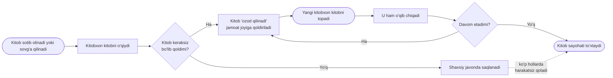

*Izoh: 1.1-rasmda ko'rinib turibdiki, an'anaviy zanjirda kitobning yangi o'quvchiga yetib borishi ko'p jihatdan tasodifга bog'liq. Kitob "ozod qilingach", uni kim va qachon topishi noma'lum, bu esa jarayonning samaradorligini pasaytiradi.*

### An'anaviy bookcrossingning asosiy muammolari

Kuzatishlar va tahlillar an'anaviy (raqamlashtirilmagan yoki qisman raqamlashtirilgan) bookcrossing tizimining bir qator muammolarini ko'rsatadi:

1. **Geografik (hududiy) cheklov.** Kitob faqat fizik jihatdan qoldirilgan joyda topilishi mumkin. Boshqa shahar yoki tumandagi kitobxon undan foydalana olmaydi.
2. **Topishdagi tasodifiylik.** Foydalanuvchi aynan o'ziga kerakli kitobni emas, balki tasodifan duch kelgan kitobni oladi. Maqsadli qidiruv imkoniyati yo'q.
3. **Aloqaning zaifligi.** Kitobni bergan va olgan kishilar o'rtasida bevosita muloqot yo'q, fikr almashish va tavsiya berish imkoniyati cheklangan.
4. **Kuzatuvning yo'qolishi.** Kitobning "sayohati" ko'pincha uziladi — yangi egasi tizimda ro'yxatdan o'tkazmaydi.
5. **Motivatsiyaning yetishmasligi.** Ishtirokchilarni faol bo'lishga undovchi rag'batlantirish mexanizmi mavjud emas.
6. **Ma'lumotlarning tarqoqligi.** Kitoblar haqidagi ma'lumotlar yagona bazada to'planmaydi, ularni tahlil qilish va tavsiya berish qiyin.

Ushbu muammolarni hal etishning eng samarali yo'li — jarayonni **raqamlashtirish**, ya'ni barcha ishtirokchilarni yagona veb-platformada birlashtirish, kitoblarni katalogga kiritish va intellektual qidiruv hamda tavsiya xizmatlarini taqdim etishdir.

### Onlayn kitob almashish jarayonining kechishi

Raqamli platforma sharoitida kitob almashish jarayoni quyidagi blok-sxemada keltirilgan ketma-ketlik bo'yicha amalga oshadi.

**1.2-rasm. Mavjud onlayn kitob almashish tizimlarida jarayonlarning kechishi (blok-sxema)**

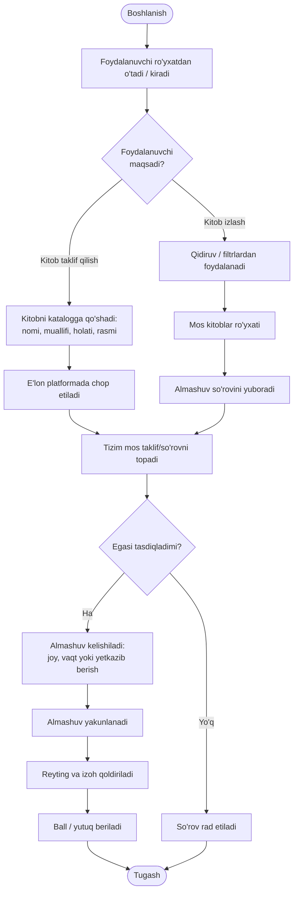

*Izoh: 1.2-rasmda ko'rsatilganidek, raqamli tizim ro'yxatdan o'tishdan tortib reyting qo'yish va rag'batlantirishgacha bo'lgan to'liq sikllni qamrab oladi. Bu an'anaviy modelga nisbatan jarayonni shaffof, kuzatiladigan va boshqariladigan qiladi.*

### Raqamlashtirish darajasining statistik tahlili

Kutubxona va kitob almashish sohasidagi raqamlashtirish darajasi turli mamlakatlar va segmentlar bo'yicha sezilarli farq qiladi. Quyida ushbu sohaning turli yo'nalishlarida raqamli xizmatlardan foydalanish darajasining shartli (taqribiy, tahliliy) ko'rsatkichlari keltirilgan.

**1.3-rasm. Kutubxona va kitob almashish sohasidagi raqamlashtirish darajasining statistik tahlili (gistogramma)**

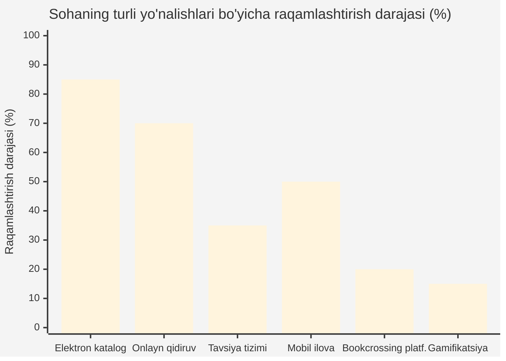

| Yo'nalish | Raqamlashtirish darajasi (%) | Izoh |
|---|---|---|
| Elektron katalog | 85 | Aksariyat kutubxonalarda mavjud |
| Onlayn qidiruv | 70 | Asosan kalit so'z bo'yicha |
| Intellektual tavsiya tizimi | 35 | Kam tarqalgan, asosan yirik platformalarda |
| Mobil ilova | 50 | O'sib bormoqda |
| Bookcrossing platformasi | 20 | Juda kam, milliy tilda deyarli yo'q |
| Gamifikatsiya elementlari | 15 | Eng kam rivojlangan yo'nalish |

*Izoh: 1.3-rasm va jadval tahlili shuni ko'rsatadiki, elektron katalog va oddiy qidiruv keng tarqalgan bo'lsa-da, intellektual tavsiya, milliy bookcrossing platformasi va gamifikatsiya yo'nalishlari sust rivojlangan. Aynan shu "bo'shliq" mazkur ishda taklif etilayotgan platforma uchun rivojlanish maydonini ochib beradi.*

### Raqamlashtirishning asosiy yo'nalishlari

Sohani tahlil qilish raqamlashtirishning bir necha asosiy yo'nalishini ajratish imkonini beradi:

1. **Kataloglashtirish va ma'lumotlar bazasi.** Kitoblar haqidagi ma'lumotlarni (metama'lumotlar: nom, muallif, ISBN, janr, nashr yili) yagona elektron bazada to'plash. Bu eng asosiy va keng tarqalgan yo'nalish.

2. **Qidiruv va navigatsiya.** Foydalanuvchiga kerakli kitobni tez topish imkonini berish. Oddiy qidiruvdan intellektual semantik qidiruvga o'tish bu yo'nalishning rivojlanish vektorini belgilaydi.

3. **Shaxsiylashtirish va tavsiya.** Har bir foydalanuvchining qiziqishlariga moslashtirilgan kontent taqdim etish. Bu eng murakkab, ammo eng qimmatli yo'nalish.

4. **Ijtimoiy o'zaro ta'sir.** Foydalanuvchilar o'rtasidagi muloqot, sharhlar, baholashlar va hamjamiyat shakllantirishni qo'llab-quvvatlash.

5. **Rag'batlantirish (gamifikatsiya).** Foydalanuvchilarni faollikka undovchi mexanizmlar joriy etish.

Bugungi kunda aksariyat tizimlar dastlabki ikki yo'nalishni qamrab olgan bo'lsa, oxirgi uch yo'nalish — ayniqsa milliy sharoitda — yetarlicha rivojlantirilmagan. Mazkur loyiha barcha besh yo'nalishni qamrab olishga qaratilgan.

### Bookcrossing harakatining tarixi va rivojlanish bosqichlari

Bookcrossing g'oyasi 2001-yilning aprel oyida amerikalik dasturchi Ron Hornbeker tomonidan asos solindi. Uning g'oyasi oddiy edi: o'qib bo'lingan kitobni "ozod qilish", ya'ni jamoat joyiga qoldirish va uning keyingi sayohatini internet orqali kuzatish. Dastlabki yillarda harakat asosan AQSh va G'arbiy Yevropa mamlakatlarida tarqaldi. Vaqt o'tishi bilan bookcrossing global hodisaga aylandi va bugungi kunda dunyoning 130 dan ortiq mamlakatida millionlab ishtirokchilarni birlashtiradi.

Bookcrossing harakatining rivojlanishini shartli ravishda uch bosqichga bo'lish mumkin:

1. **Birinchi bosqich (2001–2008) — fizik bookcrossing.** Kitoblar jamoat joylariga qoldiriladi, ularning sayohati maxsus identifikator (BCID) orqali veb-saytda qayd etiladi. Bu bosqichda asosiy e'tibor kitobning fizik harakatiga qaratilgan edi.

2. **Ikkinchi bosqich (2008–2015) — ijtimoiy tarmoqlar ta'siri.** Goodreads va shunga o'xshash platformalarning paydo bo'lishi bilan kitobxonlar nafaqat kitob almashish, balki fikr almashish, sharh yozish va o'qish ro'yxatlarini yuritishga ham e'tibor qarata boshladilar.

3. **Uchinchi bosqich (2015 — hozirgi kun) — intellektuallashtirish.** Mashina o'rganish va sun'iy intellekt texnologiyalarining rivojlanishi bilan platformalar foydalanuvchilarga shaxsiylashtirilgan tavsiyalar bera boshladi. Aynan shu bosqichda intellektual qidiruv va tavsiya tizimlari hal qiluvchi ahamiyat kasb etdi.

### Kitobxonlik madaniyatining ijtimoiy-iqtisodiy ahamiyati

Kitobxonlik madaniyati nafaqat shaxsning, balki butun jamiyatning intellektual salohiyatini belgilaydi. Tadqiqotlar shuni ko'rsatadiki, muntazam o'qiydigan insonlarda tanqidiy fikrlash, empatiya, diqqatni jamlash va muammolarni hal etish qobiliyati yuqori bo'ladi. Iqtisodiy nuqtai nazardan, bilimli va o'qimishli aholi innovatsion iqtisodiyotning asosiy harakatlantiruvchi kuchi hisoblanadi.

Bookcrossing harakati kitobxonlik madaniyatini rivojlantirishga bir necha jihatdan hissa qo'shadi:
- **Iqtisodiy qulaylik** — kitoblarni bepul yoki arzon almashish imkonini beradi, bu ayniqsa talabalar va kam ta'minlangan oilalar uchun muhim;
- **Ekologik foyda** — kitoblarni qayta ishlatish qog'oz iste'molini kamaytiradi, "yashil iqtisodiyot" tamoyillariga mos keladi;
- **Ijtimoiy aloqa** — umumiy qiziqishga ega insonlarni birlashtiradi, hamjamiyat hissini shakllantiradi;
- **Bilimga teng kirish** — geografik va moliyaviy to'siqlarni kamaytirib, bilim olishni demokratlashtiradi.

### Resurslarni qayta ishlatish (reuse) iqtisodiyoti konteksti

So'nggi yillarda "aylanma iqtisodiyot" (circular economy) va "ulashish iqtisodiyoti" (sharing economy) tushunchalari keng tarqaldi. Ushbu konsepsiyalar resurslarni bir marta ishlatib tashlash o'rniga, ularni qayta ishlatish, almashish va qayta tiklashni nazarda tutadi. Bookcrossing aynan shu falsafaning kitob sohasidagi amaliy ko'rinishidir. Bitta kitob o'nlab o'quvchiga xizmat qilishi mumkin, bu esa har bir o'quvchi alohida kitob sotib olishiga nisbatan ancha samarali.

Raqamli platforma bu jarayonni yanada kuchaytiradi: u kitobning "hayot sikli"ni uzaytiradi, uning eng ko'p o'quvchiga yetib borishini ta'minlaydi va almashinuvni shaffof, ishonchli hamda qulay qiladi.

**Birinchi paragraf bo'yicha xulosa.** Bookcrossing harakati katta ijtimoiy va ma'rifiy salohiyatga ega bo'lsa-da, an'anaviy ko'rinishda jiddiy cheklovlarga duch keladi. Bu cheklovlarni bartaraf etishning yagona samarali yo'li — jarayonni intellektual veb-platforma orqali raqamlashtirish. Ayniqsa, intellektual qidiruv, tavsiya tizimi va gamifikatsiya yo'nalishlarining sust rivojlanganligi ushbu sohada yangi yechimlarga ehtiyoj borligini ko'rsatadi.

---

## 1.2. Intellektual axborot-qidiruv tizimlari va ularning veb-platformalardagi o'rni

**Axborot-qidiruv tizimi (Information Retrieval System, IRS)** — bu katta hajmdagi tartiblanmagan yoki yarim tartiblangan ma'lumotlar to'plamidan (matn, hujjat, kitob) foydalanuvchining axborot ehtiyojiga eng mos keladigan obyektlarni topib beruvchi dasturiy tizimdir. IRS ma'lumotlar bazasi tizimlaridan (DBMS) farq qiladi: agar DBMS aniq strukturali so'rovlar (masalan, SQL) bilan ishlasa, IRS noaniq, tabiiy tildagi so'rovlar bilan ishlaydi va natijalarni **relevantlik (moslik)** darajasi bo'yicha tartiblaydi.

### Axborot-qidiruv tizimining tarkibiy qismlari

Klassik IRS quyidagi asosiy modullardan tashkil topadi:
- **Hujjatlar to'plami (corpus)** — qidiriladigan barcha obyektlar (kitoblar, tavsiflar, sharhlar);
- **Indekslash moduli** — hujjatlarni tahlil qilib, teskari indeks (inverted index) quradi;
- **So'rovni qayta ishlash moduli** — foydalanuvchi so'rovini tahlil qiladi, normallashtiradi;
- **Moslikni baholash (ranking) moduli** — hujjatlar va so'rov o'rtasidagi o'xshashlikni hisoblaydi;
- **Natijalarni taqdim etish moduli** — tartiblangan natijalarni foydalanuvchiga qaytaradi.

**1.4-rasm. Axborot-qidiruv tizimining umumiy ishlash prinsipi va tarkibiy qismlari**

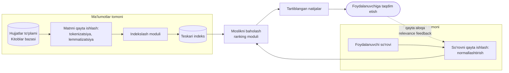

*Izoh: 1.4-rasmda IRS ikki asosiy oqimdan iborat ekanligi ko'rsatilgan: ma'lumotlarni oldindan indekslash (offline) va foydalanuvchi so'roviga real vaqtda javob berish (online). Qayta aloqa (feedback) mexanizmi tizimni vaqt o'tishi bilan aniqroq qiladi.*

### Vektor fazo modeli va TF-IDF

Zamonaviy IRS asosida ko'pincha **vektor fazo modeli (Vector Space Model)** yotadi. Bunda har bir hujjat va so'rov ko'p o'lchovli fazodagi vektor sifatida ifodalanadi. Vektor komponentlari so'zlarning **vazni (weight)** orqali aniqlanadi. Eng keng tarqalgan vaznlash usuli — **TF-IDF (Term Frequency – Inverse Document Frequency)**:

```
tf-idf(t, d) = tf(t, d) × idf(t)

idf(t) = log( N / df(t) )
```

bu yerda:
- `tf(t, d)` — `t` so'zining `d` hujjatdagi uchrash chastotasi;
- `df(t)` — `t` so'zi uchragan hujjatlar soni;
- `N` — hujjatlar umumiy soni.

So'rov va hujjat o'rtasidagi o'xshashlik **kosinus o'xshashligi (cosine similarity)** orqali hisoblanadi:

```
                 A · B
sim(A, B) = ───────────────
              ||A|| × ||B||
```

Bu yondashuv "intellektual qidiruv"ning asosini tashkil etadi, chunki u shunchaki so'zning bor-yo'qligini emas, balki uning **ahamiyatini** hisobga oladi.

**TF-IDF hisoblashga oid misol.** Faraz qilaylik, bazada 1000 ta kitob tavsifi (N=1000) bor. "roman" so'zi 200 ta hujjatda uchraydi, "ekzistensializm" so'zi esa atigi 10 ta hujjatda. Ma'lum bir hujjatda ikkala so'z ham 3 martadan ishlatilgan.

```
idf("roman")          = log(1000/200) = log(5)   ≈ 0.70
idf("ekzistensializm") = log(1000/10)  = log(100) ≈ 2.00

tf-idf("roman", d)          = 3 × 0.70 = 2.10
tf-idf("ekzistensializm", d) = 3 × 2.00 = 6.00
```

Ko'rinib turibdiki, kam uchraydigan "ekzistensializm" so'zi ancha yuqori vaznga ega bo'ladi. Bu mantiqan to'g'ri: noyob va spetsifik so'zlar hujjatni boshqalardan ko'proq farqlaydi va shuning uchun qidiruvda muhimroqdir. Aksincha, deyarli barcha hujjatlarda uchraydigan keng tarqalgan so'zlar past vaznga ega bo'ladi. TF-IDF ning kuchi aynan shu — so'zlarning ajratuvchi qobiliyatini avtomatik hisoblashidadir.

### Oddiy va intellektual (semantik) qidiruvning farqi

Oddiy matnli qidiruv aniq so'zlarni mos kelishi (exact match) bo'yicha ishlaydi va so'zning ma'nosini tushunmaydi. Intellektual (semantik) qidiruv esa so'zning kontekstini, sinonimlarni va ma'noviy yaqinlikni hisobga oladi.

**1.5-rasm. Oddiy matnli qidiruv va intellektual (semantik) qidiruv tizimlarining solishtirma sxemasi**

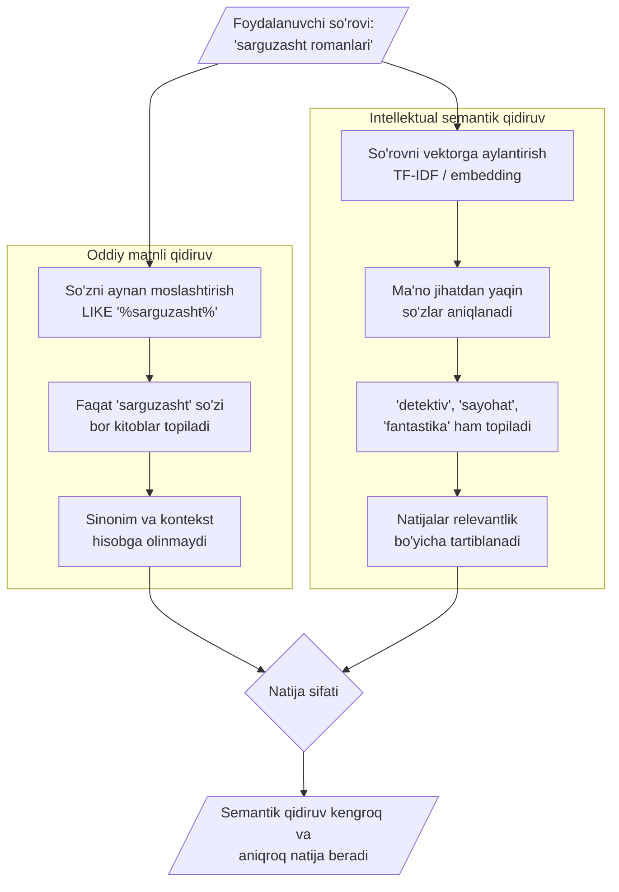

*Izoh: 1.5-rasmda ko'rinishicha, oddiy qidiruv tor va "qattiq" natija bersa, semantik qidiruv foydalanuvchi niyatini tushunib, kengroq va sifatliroq natijalarni taqdim etadi.*

### Veb-platformalarda indekslash va qidirish jarayoni

Veb-platformada ma'lumotlar avval to'planadi, qayta ishlanadi va indekslanadi, so'ngra foydalanuvchi so'rovi bo'yicha qidiriladi. Quyidagi oqim diagrammasi ushbu jarayonni ko'rsatadi.

**1.6-rasm. Veb-platformalarda ma'lumotlarni indekslash va qidirish jarayoni oqimi**

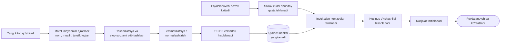

*Izoh: 1.6-rasm indekslashning "offline" (kitob qo'shilganda) va qidiruvning "online" (so'rov kiritilganda) bosqichlari bir xil matn qayta ishlash quvurini (pipeline) ishlatishini ko'rsatadi. Bu izchillik qidiruv aniqligini ta'minlaydi.*

### Axborot-qidiruv tizimlarining asosiy modellari

Axborot-qidiruv nazariyasida bir necha klassik model mavjud bo'lib, ular hujjat va so'rov o'rtasidagi moslikni turlicha hisoblaydi:

**1. Bul (Boolean) modeli.** Eng oddiy model bo'lib, so'rov mantiqiy operatorlar (AND, OR, NOT) yordamida tuziladi. Hujjat so'rovga yo to'liq mos keladi, yo mos kelmaydi — oraliq holat yo'q. Masalan, "roman AND tarix" so'rovi ikkala so'zni ham o'z ichiga olgan hujjatlarni qaytaradi. Bu modelning kamchiligi — natijalarni relevantlik darajasi bo'yicha tartiblay olmasligi.

**2. Vektor fazo modeli (Vector Space Model).** Yuqorida batafsil ko'rib chiqilgan ushbu model hujjat va so'rovni vektor sifatida ifodalaydi va ular orasidagi burchak (kosinus o'xshashligi) orqali moslikni hisoblaydi. Bu model natijalarni tartiblash imkonini beradi va eng keng tarqalgan model hisoblanadi.

**3. Ehtimollik modeli (Probabilistic Model).** Bu model hujjatning so'rovga relevant bo'lish ehtimolligini hisoblaydi. Eng mashhur amalga oshirilishi — BM25 (Best Matching 25) algoritmi bo'lib, u zamonaviy qidiruv tizimlarida (masalan, Elasticsearch) keng qo'llaniladi. BM25 TF-IDF ga o'xshaydi, ammo hujjat uzunligini va so'z chastotasining "to'yinishini" hisobga oladi:

```
                              tf(t,d) · (k+1)
BM25(t,d) = idf(t) · ──────────────────────────────────────
                      tf(t,d) + k · (1 - b + b · |d|/avgdl)

bu yerda: k va b — sozlash parametrlari (odatda k=1.2, b=0.75)
          |d| — hujjat uzunligi, avgdl — o'rtacha hujjat uzunligi
```

**4. Semantik modellar (embedding asosida).** Zamonaviy yondashuvlarda so'zlar va hujjatlar ko'p o'lchovli "embedding" vektorlariga aylantiriladi (word2vec, GloVe, BERT). Bu vektorlar so'zlarning ma'noviy yaqinligini aks ettiradi: ma'no jihatdan yaqin so'zlar fazoda yaqin joylashadi. Bu eng ilg'or yondashuv bo'lib, sinonimlar va kontekstni eng yaxshi tushunadi.

### Indekslash va teskari indeks (inverted index)

Katta hajmdagi hujjatlar orasidan tez qidirish uchun **teskari indeks** (inverted index) ma'lumotlar tuzilmasi qo'llaniladi. Oddiy indeks "hujjat → so'zlar" tarzida bo'lsa, teskari indeks "so'z → hujjatlar ro'yxati" tarzida tuziladi. Bu har bir so'z qaysi hujjatlarda uchrashini tez topish imkonini beradi.

Masalan, uchta kitob tavsifi berilgan bo'lsin:
- D1: "tarixiy roman"
- D2: "tarixiy hujjat"
- D3: "ilmiy roman"

Teskari indeks quyidagicha bo'ladi:
```
"tarixiy" → [D1, D2]
"roman"   → [D1, D3]
"hujjat"  → [D2]
"ilmiy"   → [D3]
```

"tarixiy roman" so'rovi kelganda, tizim "tarixiy" → [D1, D2] va "roman" → [D1, D3] ro'yxatlarini birlashtiradi va D1 ikkala so'zni ham o'z ichiga olgani uchun eng yuqori reytingga ega bo'ladi.

### Matnni oldindan qayta ishlash (preprocessing) bosqichlari

Sifatli qidiruv uchun matn indekslanishdan oldin bir necha bosqichdan o'tkaziladi:

1. **Tokenizatsiya** — matnni alohida so'zlarga (tokenlarga) ajratish;
2. **Kichik harfga keltirish** (lowercasing) — "Kitob" va "kitob" bir xil hisoblanishi uchun;
3. **Stop-so'zlarni olib tashlash** — "va", "bilan", "uchun" kabi ma'no tashimaydigan keng tarqalgan so'zlarni chiqarib tashlash;
4. **Stemming yoki lemmatizatsiya** — so'zlarni asosiy shakliga keltirish ("kitoblar" → "kitob", "o'qidi" → "o'qi"). Bu o'zbek tili kabi agglyutinativ (qo'shimchalarga boy) tillar uchun ayniqsa muhim, chunki bir so'z o'nlab shaklda uchrashi mumkin.

O'zbek tilining morfologik xususiyatlari (boy qo'shimchalar tizimi, lotin va kirill yozuvlarining birga ishlatilishi) qidiruv tizimini loyihalashda alohida e'tibor talab qiladi. Shu sababli platformada o'zbek tili uchun maxsus moslashtirilgan stop-so'zlar ro'yxati va normallashtirish qoidalari qo'llaniladi.

**Ikkinchi paragraf bo'yicha xulosa.** Intellektual axborot-qidiruv tizimlari oddiy qidiruvga nisbatan ancha yuqori samaradorlik beradi, chunki ular so'zning ma'nosi va ahamiyatini hisobga oladi. Vektor fazo modeli va TF-IDF kabi usullar bookcrossing platformasida kitoblarni mazmunан qidirish va saralash uchun asos bo'lib xizmat qiladi.

---

## 1.3. Mavjud muqobil platformalar tahlili va ishlab chiqilayotgan tizimning afzalliklari

Ishlab chiqilayotgan platformaning o'rnini aniqlash va afzalliklarini asoslash uchun dunyoda mavjud yetakchi platformalarni tahlil qilish zarur. Eng mashhurlari: **BookCrossing.com**, **Goodreads**, **LibraryThing** va **BookMooch**.

### Yetakchi platformalar interfeysi va funksiyalari tahlili

- **BookCrossing.com** — bookcrossing harakatining asoschisi (2001). Kitoblarga BCID beradi, ularning sayohatini kuzatadi. Interfeysi eskirgan, intellektual qidiruv va tavsiya zaif.
- **Goodreads** (Amazon) — dunyodagi eng yirik kitobxonlar ijtimoiy tarmog'i. Kuchli tavsiya tizimi, sharhlar, reytinglar mavjud. Biroq u kitob *almashish* emas, balki kitoblarni *kuzatish* va *baholash*ga yo'naltirilgan.
- **LibraryThing** — shaxsiy kutubxona katalogi. Kuchli kataloglash va teglar tizimi, ammo ijtimoiy va almashuv funksiyalari cheklangan.
- **BookMooch** — kitob almashish kredit tizimiga asoslangan. Mantiq qiziq, lekin interfeys va intellektual xizmatlar zaif.

**1.7-rasm. Dunyodagi yetakchi bookcrossing va adabiyot platformalarining interfeys tahlili**

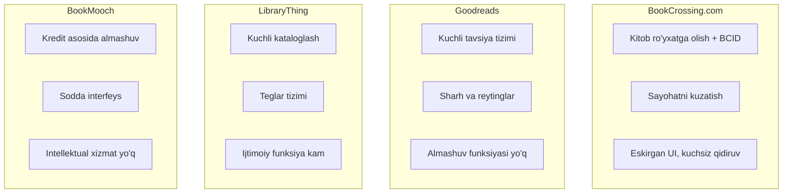

*Izoh: 1.7-rasm har bir platformaning kuchli va kuchsiz tomonlarini vizual ko'rsatadi. Ko'rinib turibdiki, birorta platforma "almashuv + intellektual qidiruv + tavsiya + gamifikatsiya"ni yaxlit birlashtirmagan.*

### Funksional imkoniyatlar bo'yicha qiyosiy tahlil va SWOT

Quyidagi jadvalda platformalar asosiy funksiyalar bo'yicha solishtirildi (✓ — mavjud, ◐ — qisman, ✗ — yo'q).

| Funksiya | BookCrossing | Goodreads | LibraryThing | BookMooch | **Ishlab chiqilayotgan tizim** |
|---|:---:|:---:|:---:|:---:|:---:|
| Kitob almashish | ✓ | ✗ | ✗ | ✓ | **✓** |
| Intellektual (semantik) qidiruv | ✗ | ◐ | ◐ | ✗ | **✓** |
| Tavsiya tizimi (CF) | ✗ | ✓ | ◐ | ✗ | **✓** |
| Gamifikatsiya (ball, reyting) | ◐ | ◐ | ✗ | ◐ | **✓** |
| O'zbek tili qo'llab-quvvatlash | ✗ | ✗ | ✗ | ✗ | **✓** |
| Zamonaviy UI/UX | ✗ | ✓ | ◐ | ✗ | **✓** |
| Mobil moslashuvchanlik | ◐ | ✓ | ◐ | ✗ | **✓** |

**1.8-rasm. Muqobil tizimlarning funksional imkoniyatlari bo'yicha solishtirma diagrammasi (SWOT tahlil chizmasi)**

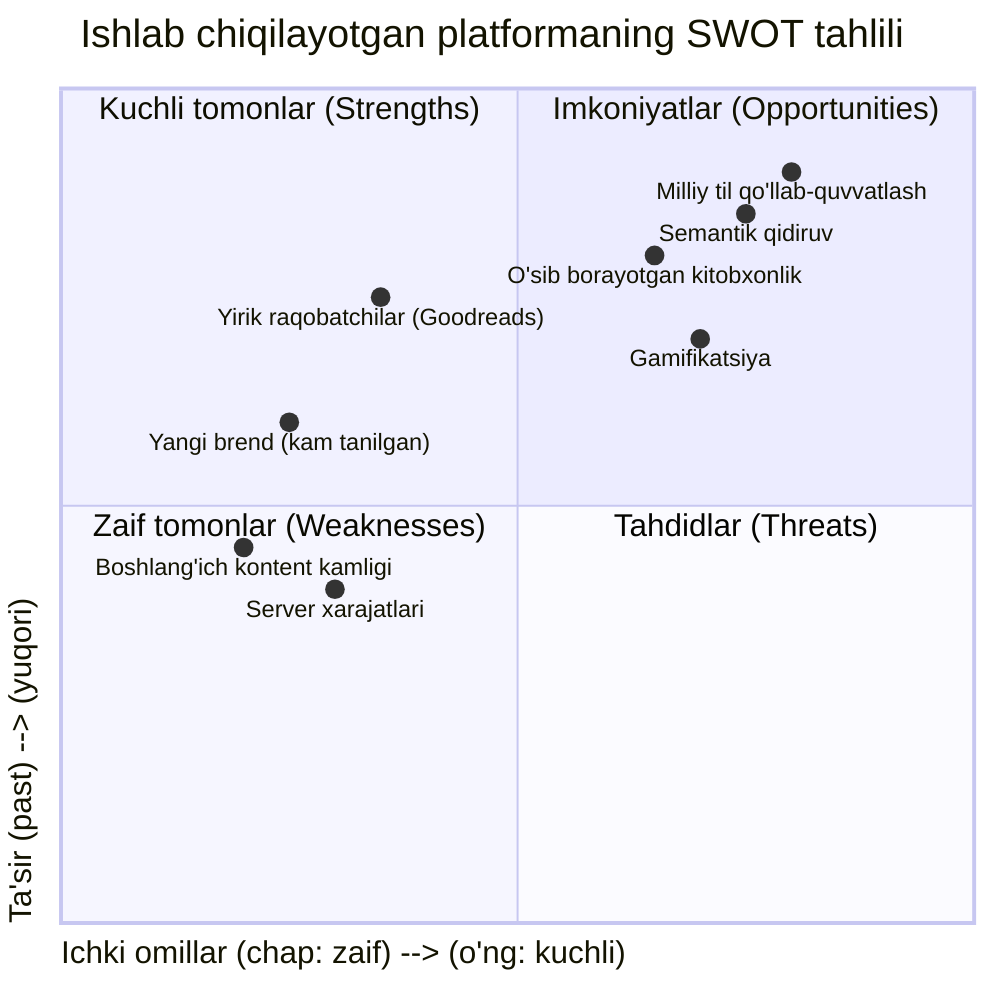

*Izoh: 1.8-rasmdagi SWOT chizmasida kuchli tomonlar (semantik qidiruv, milliy til, gamifikatsiya), imkoniyatlar (kitobxonlik o'sishi), zaif tomonlar (boshlang'ich kontent kamligi) va tahdidlar (yirik raqobatchilar) joylashtirilgan. Bu strategik rejalashtirish uchun asos beradi.*

### Ishlab chiqilayotgan tizimning konseptual farqlari va yangiliklari

Mavjud platformalar tahlili shuni ko'rsatadiki, ishlab chiqilayotgan tizim quyidagi yangiliklar bilan ajralib turadi.

**1.9-rasm. Ishlab chiqilayotgan intellektual platformaning konseptual farqlari va yangiliklari sxemasi**

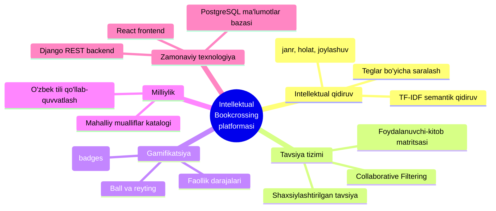

*Izoh: 1.9-rasmda platformaning beshta asosiy ustuni — intellektual qidiruv, tavsiya tizimi, gamifikatsiya, milliylik va zamonaviy texnologiyalar — ko'rsatilgan. Aynan shu beshlikning yaxlit birlashtirilishi tizimning asosiy ilmiy-amaliy yangiligini tashkil etadi.*

### Har bir platformaning batafsil tahlili

**BookCrossing.com.** Harakatning asoschisi sifatida, ushbu platforma kitobning fizik sayohatini kuzatishga ixtisoslashgan. Har bir kitobga noyob BCID raqami beriladi va foydalanuvchilar kitobni topgan yoki qoldirgan joyni qayd etadilar. Kuchli tomoni — global hamjamiyat va kitob sayohatini kuzatish g'oyasi. Zaif tomonlari: interfeys 2000-yillar dizaynida qolib ketgan, mobil moslashuvchanlik past, intellektual qidiruv va shaxsiylashtirilgan tavsiyalar deyarli yo'q, ko'p tillilik cheklangan.

**Goodreads.** 2007-yilda tashkil etilgan va 2013-yilda Amazon tomonidan sotib olingan ushbu platforma dunyodagi eng yirik kitobxonlar ijtimoiy tarmog'idir (90 milliondan ortiq foydalanuvchi). Kuchli tomonlari: rivojlangan tavsiya tizimi, boy sharhlar va reytinglar bazasi, o'qish "challenge"lari, kitob klublari. Asosiy cheklov — platforma kitob *almashish*ga emas, balki kitoblarni *kuzatish va baholash*ga yo'naltirilgan. Bundan tashqari, o'zbek tili va mahalliy adabiyot deyarli qo'llab-quvvatlanmaydi.

**LibraryThing.** Shaxsiy kutubxona katalogini yuritishga ixtisoslashgan platforma. Kuchli tomonlari: juda batafsil kataloglash imkoniyatlari, kuchli teglar tizimi, bibliografik ma'lumotlarning aniqligi. Zaif tomonlari: ijtimoiy va almashuv funksiyalari cheklangan, interfeys murakkab, yangi foydalanuvchilar uchun o'rganish qiyin.

**BookMooch.** Kredit tizimiga asoslangan kitob almashish platformasi: foydalanuvchi kitob bergani uchun kredit oladi va uni boshqa kitob olish uchun ishlatadi. Kuchli tomoni — adolatli almashuv mexanizmi. Zaif tomonlari: eskirgan interfeys, intellektual xizmatlarning yo'qligi, faollikning pasayishi.

### Qiyosiy tahlil natijalari va bo'shliqni aniqlash

Yuqoridagi tahlil shuni ko'rsatadiki, mavjud platformalar ma'lum yo'nalishlarda kuchli, ammo hech biri yaxlit yechim taqdim etmaydi:
- BookCrossing — almashuvga kuchli, lekin intellektual emas;
- Goodreads — intellektual, lekin almashuv yo'q;
- LibraryThing — kataloglashga kuchli, lekin ijtimoiy emas;
- BookMooch — almashuvga adolatli, lekin zamonaviy emas.

Bundan tashqari, **birorta platforma o'zbek tilini va mahalliy adabiyot kontekstini to'liq qo'llab-quvvatlamaydi**. Bu milliy sharoit uchun jiddiy bo'shliq hisoblanadi. Aynan shu bo'shliqni to'ldirish ishlab chiqilayotgan platformaning asosiy maqsadi va yangiligini belgilaydi.

**Ishlab chiqilayotgan tizimning asosiy afzalliklari** quyidagilardan iborat:
1. **Yaxlitlik** — kitob almashish, intellektual qidiruv, tavsiya, gamifikatsiya bir platformada;
2. **Milliylik** — o'zbek tili va mahalliy adabiyotni to'liq qo'llab-quvvatlash;
3. **Intellektuallik** — TF-IDF semantik qidiruv va kollaborativ filtrlash;
4. **Zamonaviylik** — React/Django asosidagi tezkor, responsiv interfeys;
5. **Motivatsiya** — gamifikatsiya orqali foydalanuvchilarni faol ushlab turish.

**Birinchi bob bo'yicha umumiy xulosa.** Birinchi bobda kitobxonlik va bookcrossingni raqamlashtirishning hozirgi holati, an'anaviy tizimning muammolari, intellektual axborot-qidiruv tizimlarining nazariy asoslari va mavjud platformalar tahlil qilindi. Tahlil natijasida ishlab chiqilayotgan platformaning o'rni va afzalliklari asoslandi: u kitob almashish, semantik qidiruv, tavsiya tizimi, gamifikatsiya va milliy til qo'llab-quvvatlashni yagona muhitda birlashtiradi. Keyingi bobda ushbu g'oyalar texnik loyiha darajasiga olib chiqiladi.


---

# II BOB. PLATFORMANING INTELLEKTUAL ALGORITMLARI VA ARXITEKTURASINI LOYIHALASH

## 2.1. Veb-platformaning funksional va texnik talablarini loyihalash

Har qanday dasturiy mahsulotni ishlab chiqish jarayoni talablarni aniqlashdan boshlanadi. Talablar muhandisligi (Requirements Engineering) — bu loyihaning eng muhim va eng ko'p xato ketadigan bosqichlaridan biridir. Statistik ma'lumotlarga ko'ra, dasturiy loyihalardagi muvaffaqiyatsizliklarning katta qismi aynan talablarni noto'g'ri yoki to'liqsiz aniqlash bilan bog'liq. Shu sababli mazkur bobда platforma talablari batafsil ishlab chiqildi.

Talablar ikki katta toifaga bo'linadi: **funksional talablar (functional requirements)** — tizim nima qilishi kerakligini belgilaydi; **nofunksional talablar (non-functional requirements)** — tizim qanday ishlashi kerakligini (tezlik, xavfsizlik, ishonchlilik) belgilaydi.

### Funksional talablar

Platformaning funksional talablari foydalanuvchi rollari kesimida quyidagicha shakllantirildi:

**Mehmon (Guest) — ro'yxatdan o'tmagan foydalanuvchi:**
- FT-1: Bosh sahifani va ommaviy kitoblar katalogini ko'rish;
- FT-2: Kitoblarni qidirish va filtrlash (cheklangan);
- FT-3: Ro'yxatdan o'tish va tizimga kirish.

**Ro'yxatdan o'tgan foydalanuvchi (Registered User):**
- FT-4: Shaxsiy profil yaratish va tahrirlash;
- FT-5: Kitob qo'shish (e'lon berish): nomi, muallifi, janri, holati, rasmi, tavsifi;
- FT-6: Intellektual qidiruv va kengaytirilgan filtrlardan foydalanish;
- FT-7: Boshqa foydalanuvchilarga almashuv so'rovini yuborish;
- FT-8: Kelgan so'rovlarni qabul qilish yoki rad etish;
- FT-9: Almashuv yakunlangach reyting va sharh qoldirish;
- FT-10: Shaxsiy "virtual javon"ni boshqarish (o'qigan, o'qiyotgan, xohlagan kitoblar);
- FT-11: Tizimdan shaxsiylashtirilgan kitob tavsiyalarini olish;
- FT-12: Ball, reyting va yutuqlarni kuzatish (gamifikatsiya);
- FT-13: Bildirishnomalar olish (so'rov, javob, yangi tavsiya).

**Administrator (Admin):**
- FT-14: Foydalanuvchilarni boshqarish (bloklash, rollarni o'zgartirish);
- FT-15: Kitoblar va e'lonlarni moderatsiya qilish;
- FT-16: Janrlar va teglar katalogini boshqarish;
- FT-17: Statistik hisobotlarni ko'rish;
- FT-18: Shikoyatlar va nizolarni ko'rib chiqish.

### Nofunksional talablar

| Kod | Talab toifasi | Ta'rif | Maqsadli ko'rsatkich |
|---|---|---|---|
| NFT-1 | Unumdorlik (Performance) | Sahifa yuklanish vaqti | < 2 sekund |
| NFT-2 | Unumdorlik | API javob vaqti (o'rtacha) | < 300 ms |
| NFT-3 | Masshtablanish (Scalability) | Bir vaqtda faol foydalanuvchilar | ≥ 1000 |
| NFT-4 | Xavfsizlik (Security) | Parollarni shifrlash | bcrypt/Argon2 |
| NFT-5 | Xavfsizlik | Autentifikatsiya | JWT token |
| NFT-6 | Ishonchlilik (Reliability) | Tizim ishlash vaqti (uptime) | ≥ 99.5% |
| NFT-7 | Foydalanuvchanlik (Usability) | Mobil moslashuvchanlik | Responsive design |
| NFT-8 | Qo'llab-quvvatlanish | Kodning modulligi | REST API + komponentlar |
| NFT-9 | Lokalizatsiya | Tillarni qo'llab-quvvatlash | O'zbek, rus, ingliz |
| NFT-10 | Mosligi | Brauzerlar | Chrome, Firefox, Safari, Edge |

### Platformaning umumiy me'moriy arxitekturasi

Tizim **uch qatlamli (three-tier) "Client-Server-Database" arxitekturasi** asosida loyihalandi. Bu arxitektura keng tarqalgan, sinovdan o'tgan va masshtablanuvchi yondashuv bo'lib, mas'uliyatlarni aniq ajratish (separation of concerns) tamoyiliga asoslanadi:
- **Taqdimot qatlami (Presentation / Client)** — foydalanuvchi brauzerida ishlaydigan React ilovasi;
- **Mantiqiy qatlam (Application / Server)** — Django REST Framework asosidagi backend, biznes-mantiqni amalga oshiradi;
- **Ma'lumotlar qatlami (Data)** — PostgreSQL ma'lumotlar bazasi.

**2.1-rasm. Platformaning umumiy me'moriy arxitekturasi (Client-Server-Database modeli)**

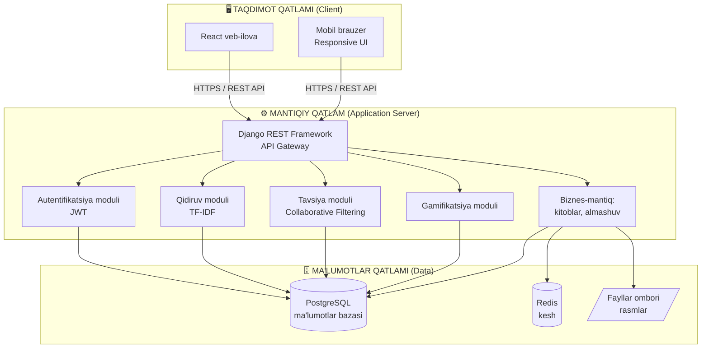

*Izoh: 2.1-rasmda har bir qatlam aniq vazifaga ega ekanligi ko'rsatilgan. Client qatlami faqat taqdimot bilan shug'ullanadi, server qatlami biznes-mantiq va intellektual modullarni o'z ichiga oladi, ma'lumotlar qatlami esa saqlash uchun javob beradi. Redis kesh tez-tez so'raladigan ma'lumotlarni tezroq taqdim etish uchun ishlatiladi.*

Bunday arxitekturaning afzalliklari quyidagilardan iborat. Birinchidan, qatlamlarni mustaqil ravishda rivojlantirish va sinovdan o'tkazish mumkin. Ikkinchidan, har bir qatlamni alohida masshtablashtirish imkoniyati mavjud — masalan, foydalanuvchilar soni ortganda faqat server qatlamiga qo'shimcha resurs ajratish kifoya. Uchinchidan, xavfsizlik nuqtai nazaridan ma'lumotlar bazasi tashqi tarmoqdan to'g'ridan-to'g'ri ajratilgan, unga faqat server qatlami orqali murojaat qilinadi.

### Use Case (Pretsedentlar) diagrammasi

Foydalanuvchilar va tizim o'rtasidagi munosabatni rasmiylashtirish uchun UML Use Case diagrammasidan foydalanildi. Diagrammada uchta asosiy aktyor (mehmon, foydalanuvchi, administrator) va ularning tizim bilan o'zaro ta'siri ko'rsatilgan.

**2.2-rasm. Foydalanuvchilar va tizim o'rtasidagi munosabatni ko'rsatuvchi UML Use Case diagrammasi**

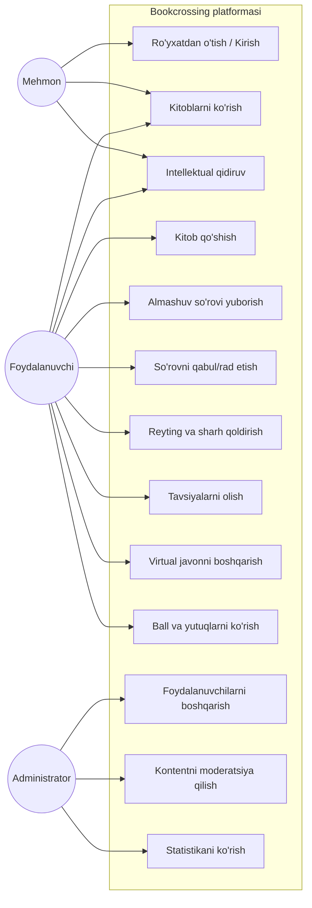

*Izoh: 2.2-rasmda ko'rinishicha, mehmon faqat cheklangan funksiyalardan (ko'rish, qidirish, ro'yxatdan o'tish) foydalanadi. Ro'yxatdan o'tgan foydalanuvchi to'liq funksional imkoniyatlarga ega. Administrator esa tizimni boshqarish funksiyalarini bajaradi. Bu rollarni ajratish xavfsizlik va boshqaruv qulayligini ta'minlaydi.*

### Kitob almashish jarayonining Sequence diagrammasi

Tizimdagi eng muhim biznes-jarayon — kitob almashish — ning bosqichma-bosqich kechishini ko'rsatish uchun UML Sequence (ketma-ketlik) diagrammasi tuzildi. Bu diagramma obyektlar o'rtasidagi xabar almashinuvini vaqt bo'yicha ko'rsatadi.

**2.3-rasm. Tizimdagi kitob almashish jarayonining bosqichma-bosqich UML Sequence diagrammasi**

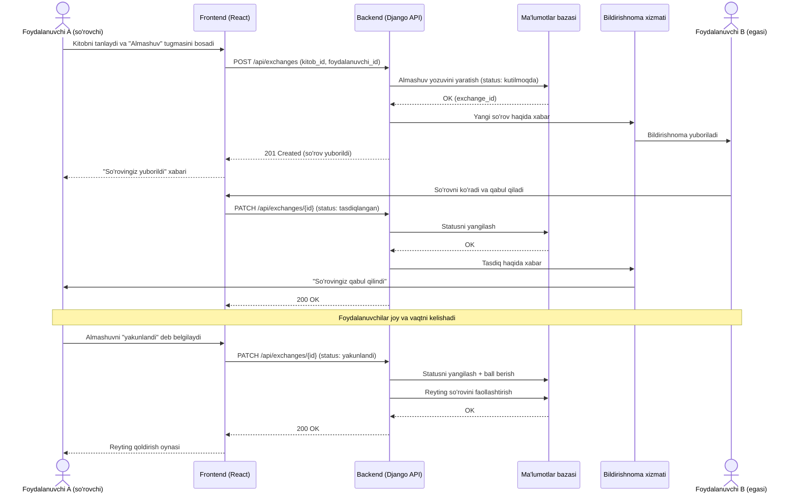

*Izoh: 2.3-rasmda almashuv jarayoni so'rov yuborishdan to yakunlash va ball berishgacha to'liq ko'rsatilgan. Har bir qadamda frontend, backend, ma'lumotlar bazasi va bildirishnoma xizmati o'rtasidagi aloqa aniq belgilangan. Bu diagramma dasturlash bosqichida API endpoint'larni to'g'ri loyihalash uchun asos bo'ldi.*

### Loyihalash metodologiyasi

Platformani ishlab chiqishda **Agile** metodologiyasining moslashtirilgan varianti qo'llanildi. Ish kichik iteratsiyalarga (sprintlarga) bo'lindi, har bir sprint oxirida ishlaydigan funksional qism taqdim etildi. Bu yondashuv talablarning o'zgarishiga moslashish, xatolarni erta aniqlash va doimiy yaxshilanishni ta'minlaydi.

Loyihalashda quyidagi ob'ektga yo'naltirilgan tahlil va loyihalash (OOAD) tamoyillariga amal qilindi:
- **Inkapsulatsiya** — ma'lumotlar va ular ustidagi amallarni bir joyda birlashtirish;
- **Modullik** — tizimni mustaqil, kam bog'langan (loosely coupled) modullarga bo'lish;
- **Qayta ishlatish (reusability)** — komponentlarni turli joylarda qayta ishlatish;
- **Mas'uliyatlarni ajratish (separation of concerns)** — har bir modul aniq bir vazifani bajaradi.

### Tizim sifat atributlari (Quality Attributes)

Nofunksional talablar bilan chambarchas bog'liq bo'lgan sifat atributlari arxitektura qarorlariga bevosita ta'sir qiladi:

- **Masshtablanish (Scalability).** Tizim foydalanuvchilar soni ortishi bilan ishlash qobiliyatini saqlashi kerak. Buning uchun gorizontal masshtablash (qo'shimcha serverlar qo'shish) imkoniyati ko'zda tutilgan: stateless backend va JWT autentifikatsiya bir nechta server nusxasini ishga tushirishga imkon beradi.

- **Mavjudlik (Availability).** Tizim yuqori ishonchlilik (uptime ≥ 99.5%) bilan ishlashi kerak. Buning uchun ma'lumotlar bazasining zaxira nusxalari (backup) va xatolardan tiklanish mexanizmlari joriy etiladi.

- **Xavfsizlik (Security).** Foydalanuvchi ma'lumotlari himoyalanishi shart: parollar Argon2/bcrypt bilan xeshlanadi, aloqa HTTPS orqali shifrlanadi, API'da ruxsatlar (permissions) qat'iy nazorat qilinadi, SQL-injection va XSS hujumlaridan himoya ta'minlanadi.

- **Qo'llab-quvvatlanish (Maintainability).** Kod toza, hujjatlashtirilgan va modulli bo'lishi kerak. REST API standartlariga rioya qilish va komponentli arxitektura kelajakda tizimni rivojlantirishni osonlashtiradi.

### Texnik talablar matritsasi

Funksional talablar bilan tizim komponentlari o'rtasidagi bog'liqlikni ko'rsatuvchi kuzatuv matritsasi (traceability matrix) tuzildi:

| Talab | Backend moduli | Frontend komponenti | Ma'lumotlar bazasi jadvali |
|---|---|---|---|
| Ro'yxatdan o'tish (FT-3) | users | RegisterForm | users |
| Kitob qo'shish (FT-5) | books | AddBookForm | books, tags |
| Intellektual qidiruv (FT-6) | search | SearchPage | books (indeks) |
| Almashuv (FT-7,8,9) | exchanges | ExchangePanel | exchanges |
| Tavsiya (FT-11) | recommendations | RecommendList | ratings |
| Gamifikatsiya (FT-12) | gamification | ProfileBadges | users, achievements |

Bu matritsa har bir talab amalga oshirilganligini tekshirish va testlash qamrovini ta'minlash uchun foydalidir.

**2.1-paragraf bo'yicha xulosa.** Ushbu paragrafda platformaning funksional va nofunksional talablari aniqlandi, uch qatlamli arxitektura tanlandi va asoslandi, hamda UML Use Case va Sequence diagrammalari yordamida foydalanuvchi-tizim o'zaro ta'siri rasmiylashtirildi. Bu loyihaning mustahkam texnik poydevorini tashkil etadi.

---

## 2.2. Axborot-qidiruv va adabiyotlarni tavsiya qilishning intellektual modellari

Platformaning "intellektualligi"ni belgilovchi ikkita asosiy mexanizm — bu **intellektual qidiruv** va **tavsiya tizimi**dir. Ushbu paragrafda ularning matematik asoslari va algoritmik realizatsiyasi batafsil ko'rib chiqiladi.

### Kalit so'zlar va teglar bo'yicha intellektual saralash

Foydalanuvchi so'rov kiritganda, tizim quyidagi bosqichlarni bajaradi: so'rovni qayta ishlash, nomzod kitoblarni indeks orqali topish, har bir nomzodning relevantligini hisoblash va natijalarni tartiblash. Bunda nafaqat matn mosligi, balki teglar, janr, kitob holati va joylashuv kabi omillar ham hisobga olinadi.

Saralashning yakuniy bahosi quyidagi kombinatsiyalangan formulada hisoblanadi:

```
Score(kitob) = w1·TextSim + w2·TagMatch + w3·PopularityScore + w4·LocationProximity

bu yerda:
  TextSim          — TF-IDF kosinus o'xshashligi (0..1)
  TagMatch         — teglar mosligi koeffitsienti (0..1)
  PopularityScore  — kitob mashhurligi (normallashtirilgan)
  LocationProximity — joylashuv yaqinligi (0..1)
  w1..w4           — vaznlar (w1+w2+w3+w4 = 1), masalan: 0.5, 0.25, 0.15, 0.1
```

**2.4-rasm. Kitoblarni kalit so'zlar va teglar bo'yicha intellektual saralash algoritmi blok-sxemasi**

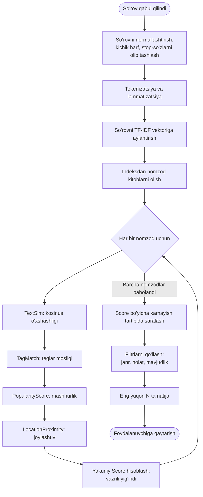

*Izoh: 2.4-rasmdagi blok-sxema qidiruv algoritmining to'liq mantiqini ko'rsatadi. Algoritm faqat matn mosligiga emas, balki to'rtta omilning vaznli kombinatsiyasiga asoslanadi, bu esa natijalarning yuqori relevantligini ta'minlaydi.*

Quyida ushbu algoritmning Python'dagi soddalashtirilgan namunasi keltirilgan:

```python
from sklearn.feature_extraction.text import TfidfVectorizer
from sklearn.metrics.pairwise import cosine_similarity
import numpy as np

def intellektual_qidiruv(sorov, kitoblar, vaznlar=(0.5, 0.25, 0.15, 0.1)):
    w1, w2, w3, w4 = vaznlar
    matnlar = [k['tavsif'] for k in kitoblar]

    # TF-IDF vektorlari
    vectorizer = TfidfVectorizer()
    tfidf = vectorizer.fit_transform(matnlar + [sorov['matn']])
    text_sim = cosine_similarity(tfidf[-1], tfidf[:-1]).flatten()

    natijalar = []
    for i, kitob in enumerate(kitoblar):
        tag_match = len(set(sorov['teglar']) & set(kitob['teglar'])) / \
                    max(len(sorov['teglar']), 1)
        popularity = kitob['mashhurlik'] / 100.0
        location = 1.0 / (1.0 + kitob['masofa_km'])
        score = (w1 * text_sim[i] + w2 * tag_match +
                 w3 * popularity + w4 * location)
        natijalar.append((kitob['id'], score))

    return sorted(natijalar, key=lambda x: x[1], reverse=True)
```

### Tavsiya tizimi: Collaborative Filtering modeli

Tavsiya tizimlari (Recommender Systems) foydalanuvchiga uning qiziqishlariga mos kelishi mumkin bo'lgan obyektlarni taklif qiladi. Tavsiya tizimlarining uchta asosiy turi mavjud:
1. **Kontentga asoslangan filtrlash (Content-based Filtering)** — foydalanuvchi avval yoqtirgan obyektlarga o'xshash obyektlarni tavsiya qiladi;
2. **Kollaborativ filtrlash (Collaborative Filtering, CF)** — o'xshash didga ega foydalanuvchilar yoqtirgan obyektlarni tavsiya qiladi;
3. **Gibrid yondashuv (Hybrid)** — yuqoridagi ikkalasini birlashtiradi.

Mazkur platformada asosiy usul sifatida **kollaborativ filtrlash** tanlandi, chunki u "sizga o'xshash kitobxonlar bu kitobni yoqtirishdi" tamoyiliga asoslanadi va bookcrossing g'oyasiga juda mos keladi.

**2.5-rasm. Foydalanuvchilarga kitob tavsiya etuvchi (Collaborative Filtering) modelining mantiqiy tuzilishi**

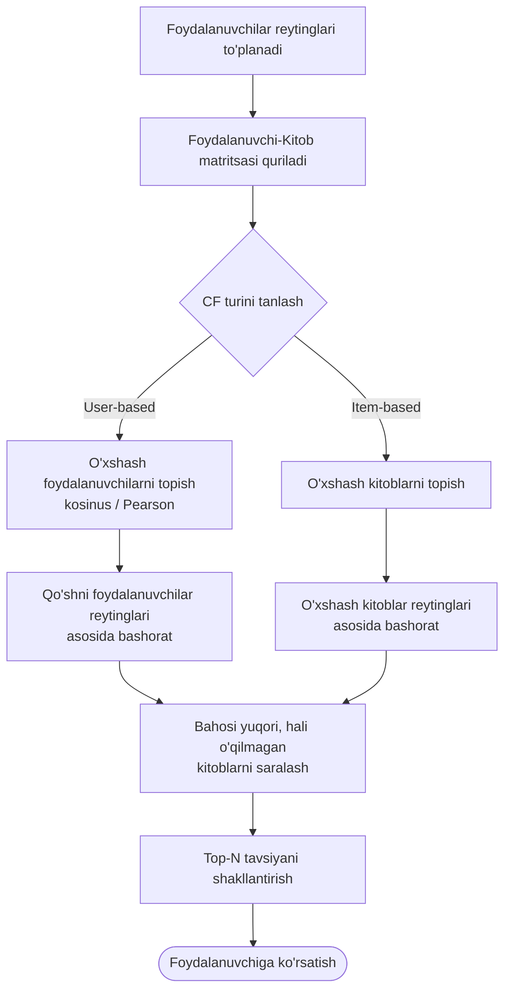

*Izoh: 2.5-rasmda CF modelining ikki varianti — foydalanuvchiga asoslangan (user-based) va obyektga asoslangan (item-based) — ko'rsatilgan. Har ikkala holatda ham asosiy g'oya o'xshashlikni aniqlash va shu asosda bashorat qilishdir.*

### Foydalanuvchi qiziqishlari matritsasi va o'xshashlikni hisoblash

Kollaborativ filtrlashning asosida **foydalanuvchi-kitob matritsasi (user-item matrix)** yotadi. Bu matritsada satrlar — foydalanuvchilar, ustunlar — kitoblar, qiymatlar esa reytinglar (masalan, 1 dan 5 gacha) bo'ladi. Matritsa odatda "siyrak" (sparse) bo'ladi, chunki har bir foydalanuvchi barcha kitoblarni baholamaydi.

Ikki foydalanuvchi o'rtasidagi o'xshashlik kosinus o'xshashligi yoki Pearson korrelyatsiyasi orqali hisoblanadi:

```
Kosinus o'xshashligi:
               Σ (r_ui · r_vi)
sim(u,v) = ───────────────────────────
           √Σ r_ui²  ·  √Σ r_vi²

Bashorat (user-based):
              Σ sim(u,v) · r_vi
pred(u,i) = ─────────────────────
                Σ |sim(u,v)|
```

**2.6-rasm. Foydalanuvchi qiziqishlari matritsasi va kitoblar o'xshashligini hisoblash sxemasi**

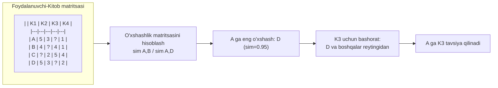

*Izoh: 2.6-rasmda 4 foydalanuvchi va 4 kitobdan iborat soddalashtirilgan matritsa misolida o'xshashlikni hisoblash va bashorat qilish ko'rsatilgan. "?" belgisi baholanmagan (noma'lum) qiymatlarni bildiradi — aynan shularni tavsiya tizimi bashorat qiladi.*

### Amaliy hisoblash misoli

Yuqoridagi nazariyani aniq misol bilan tushuntiramiz. Faraz qilaylik, foydalanuvchi A ning K3 kitobiga beradigan bahosini bashorat qilmoqchimiz. Matritsadan foydalanuvchilarning umumiy kitoblar bo'yicha reytinglari ma'lum.

A va boshqa foydalanuvchilar orasidagi kosinus o'xshashligini hisoblaymiz (faqat ikkalasi ham baholagan kitoblar bo'yicha):
- A va B: umumiy kitoblar K1, K4 → A=(5,1), B=(4,1) → sim(A,B) ≈ 0.99;
- A va D: umumiy kitoblar K1, K2, K4 → A=(5,3,1), D=(5,3,2) → sim(A,D) ≈ 0.99;
- A va C: umumiy kitoblar K2, K4 → A=(3,1), C=(2,4) → sim(A,C) ≈ 0.70.

K3 ni B (baho 4) va C (baho 5) baholagan. Bashorat:

```
            sim(A,B)·r(B,K3) + sim(A,C)·r(C,K3)
pred(A,K3) = ───────────────────────────────────
                    sim(A,B) + sim(A,C)

           = (0.99·4 + 0.70·5) / (0.99 + 0.70)
           = (3.96 + 3.50) / 1.69
           ≈ 4.41
```

Demak, tizim A foydalanuvchiga K3 kitobini taxminan 4.41 ball bilan tavsiya qiladi — bu yuqori baho, shuning uchun K3 tavsiya ro'yxatining yuqorisida ko'rsatiladi. Bu misol kollaborativ filtrlashning amaliy ishlash mexanizmini aniq ko'rsatadi.

### Matritsani faktorizatsiya qilish (Matrix Factorization)

Katta hajmdagi siyrak matritsalar uchun klassik qo'shni asosidagi CF samarasiz bo'lishi mumkin. Bunday hollarda **matritsani faktorizatsiya qilish** (masalan, SVD — Singular Value Decomposition) usuli qo'llaniladi. Bu usul foydalanuvchi-kitob matritsasini ikkita kichikroq matritsa ko'paytmasiga ajratadi: foydalanuvchilarning "yashirin xususiyatlari" (latent factors) va kitoblarning "yashirin xususiyatlari". Bu yashirin omillar, masalan, janr afzalligi, yozuv uslubi kabi yashirin qonuniyatlarni avtomatik aniqlaydi:

```
R ≈ P × Qᵀ

bu yerda: R — foydalanuvchi-kitob matritsasi (m×n)
          P — foydalanuvchi-omil matritsasi (m×k)
          Q — kitob-omil matritsasi (n×k)
          k — yashirin omillar soni (k << m, n)
```

Bu yondashuv masshtablanish va aniqlik jihatidan ustun bo'lib, platformaning kelajakdagi rivojida joriy etilishi rejalashtirilgan.

Quyida user-based CF ning soddalashtirilgan amalga oshirilishi:

```python
import numpy as np
from sklearn.metrics.pairwise import cosine_similarity

def tavsiya_qil(matritsa, foydalanuvchi_idx, top_n=5):
    # matritsa: NumPy massiv (foydalanuvchilar x kitoblar), 0 = baholanmagan
    oxshashlik = cosine_similarity(matritsa)
    bashoratlar = np.zeros(matritsa.shape[1])

    for kitob_idx in range(matritsa.shape[1]):
        if matritsa[foydalanuvchi_idx, kitob_idx] == 0:  # hali baholanmagan
            numerator = 0.0
            denominator = 0.0
            for boshqa_idx in range(matritsa.shape[0]):
                if matritsa[boshqa_idx, kitob_idx] > 0:
                    sim = oxshashlik[foydalanuvchi_idx, boshqa_idx]
                    numerator += sim * matritsa[boshqa_idx, kitob_idx]
                    denominator += abs(sim)
            if denominator > 0:
                bashoratlar[kitob_idx] = numerator / denominator

    return np.argsort(bashoratlar)[::-1][:top_n]  # eng yuqori N kitob
```

**Sovuq start (Cold Start) muammosi.** Tavsiya tizimlarining keng tarqalgan muammosi — yangi foydalanuvchi yoki yangi kitob uchun yetarli ma'lumot bo'lmasligi. Bu muammoni hal qilish uchun platformada gibrid yondashuv qo'llaniladi: yangi foydalanuvchiga avval eng mashhur va eng yuqori reytingli kitoblar, shuningdek ro'yxatdan o'tishda tanlangan qiziqishlar (janrlar) bo'yicha kontentга asoslangan tavsiyalar ko'rsatiladi. Foydalanuvchi faollashgani sari CF modeli kuchayib boradi.

### Kontentga asoslangan filtrlash modeli

Kollaborativ filtrlashdan tashqari, platformada **kontentga asoslangan filtrlash (Content-based Filtering)** ham yordamchi usul sifatida qo'llaniladi. Bu usul kitobning xususiyatlarini (janr, mualllif, teglar, tavsif) tahlil qilib, foydalanuvchi avval yoqtirgan kitoblarga o'xshashlarini topadi. Har bir kitob xususiyatlar vektori sifatida ifodalanadi va foydalanuvchining "profil vektori" uning yoqtirgan kitoblari asosida shakllantiriladi. Yangi kitob foydalanuvchi profiliga qanchalik yaqin bo'lsa, u shunchalik yuqori tavsiya etiladi.

Kontentga asoslangan filtrlashning afzalligi — u sovuq start muammosidan kamroq aziyat chekadi (yangi kitob uchun reyting kerak emas, faqat uning xususiyatlari yetarli). Kamchiligi — u foydalanuvchini faqat o'xshash kitoblar bilan cheklab qo'yishi (filter bubble) mumkin.

### Gibrid tavsiya modeli

Platformada eng yaxshi natijaga erishish uchun **gibrid model** qo'llaniladi — kollaborativ va kontentga asoslangan filtrlash birlashtiriladi. Yakuniy tavsiya bahosi quyidagicha hisoblanadi:

```
FinalScore = α · CF_Score + (1 - α) · Content_Score

bu yerda α — aralashtirish koeffitsienti (0..1).
Foydalanuvchi faolligi ortishi bilan α ortadi (CF kuchayadi),
yangi foydalanuvchi uchun esa α kichik (Content ustun bo'ladi).
```

Bu yondashuv har bir usulning kuchli tomonlaridan foydalanish va kamchiliklarini kompensatsiya qilish imkonini beradi.

### Tavsiya tizimini baholash metrikalari

Tavsiya sifatini baholash uchun bir necha metrikadan foydalaniladi:
- **MAE (Mean Absolute Error)** va **RMSE (Root Mean Square Error)** — bashorat qilingan va haqiqiy reytinglar orasidagi farqni o'lchaydi;
- **Precision@K** va **Recall@K** — top-K tavsiyaning aniqligi va to'liqligi;
- **Coverage (qamrov)** — tizim qancha kitobni tavsiya qila olishi;
- **Diversity (xilma-xillik)** — tavsiyalarning bir-biridan farqliligi;
- **Novelty (yangilik)** — tavsiyalarning foydalanuvchi uchun qanchalik yangiligi.

```
        1   n
RMSE = √─── Σ (pred_i − real_i)²
        n  i=1
```

Yaxshi tavsiya tizimi nafaqat aniq, balki xilma-xil va yangi tavsiyalar berishi kerak — faqat aniqlikka e'tibor berish "filter bubble" ga olib kelishi mumkin.

**2.2-paragraf bo'yicha xulosa.** Ushbu paragrafda platformaning ikkita asosiy intellektual mexanizmi — kombinatsiyalangan intellektual qidiruv va kollaborativ filtrlashga asoslangan tavsiya tizimi — matematik va algoritmik jihatdan ishlab chiqildi. Sovuq start muammosi uchun gibrid yechim taklif etildi.

---

## 2.3. Kitob almashinuvini rag'batlantirish (gamifikatsiya) va ma'lumotlar bazasi tuzilishi

### Gamifikatsiya mexanizmi

**Gamifikatsiya (gamification)** — o'yin elementlarini (ball, daraja, yutuq, reyting jadvali) o'yin bo'lmagan kontekstga tatbiq etish orqali foydalanuvchi faolligini oshirish usulidir. Bookcrossing platformasida gamifikatsiya foydalanuvchilarni ko'proq kitob ulashish, almashish va izoh qoldirishga undaydi.

Platformada quyidagi gamifikatsiya elementlari joriy etildi:

| Element | Tavsifi | Ball |
|---|---|---|
| Kitob qo'shish | Yangi kitob e'lon qilish | +10 ball |
| Muvaffaqiyatli almashuv | Almashuvni yakunlash | +25 ball |
| Sharh qoldirish | Kitobga sifatli izoh | +5 ball |
| Birinchi almashuv | Ilk muvaffaqiyatli almashuv | "Boshlovchi" nishoni |
| 10 ta almashuv | 10 marta almashish | "Faol kitobxon" nishoni |
| Yuqori reyting | O'rtacha reyting ≥ 4.5 | "Ishonchli a'zo" nishoni |

Foydalanuvchilarning yig'gan ballari asosida darajalar (levels) belgilanadi: Yangi a'zo (0-50), Kitobxon (51-200), Faol kitobxon (201-500), Bibliofil (501-1000), Usta (1000+).

**2.7-rasm. Foydalanuvchilarni rag'batlantirish mexanizmi (ball berish, reyting va yutuqlar) algoritmik oqimi**

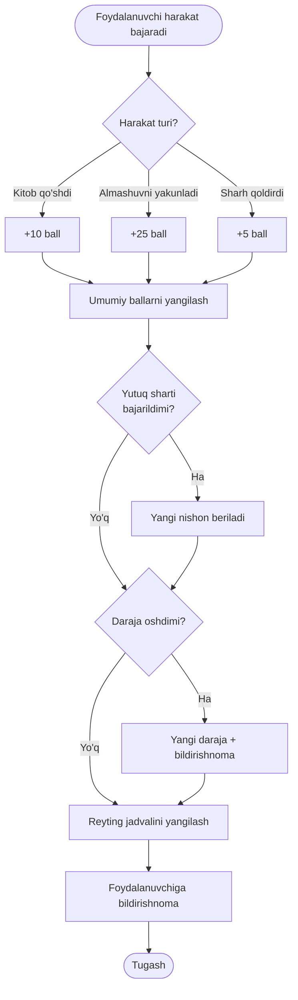

*Izoh: 2.7-rasmda gamifikatsiya tizimining to'liq mantiqiy oqimi ko'rsatilgan: harakatdan ball berishgacha, yutuq va daraja tekshiruvidan reyting jadvalini yangilashgacha. Bu mexanizm foydalanuvchilarni doimiy faollikka rag'batlantiradi.*

### Ma'lumotlar bazasining konseptual modeli (ER)

Ma'lumotlar bazasi tizimning "yuragi" hisoblanadi. Uni loyihalashda **Entity-Relationship (ER) modellashtirish** usuli qo'llanildi. Asosiy mohiyatlar (entities): **Users** (foydalanuvchilar), **Books** (kitoblar), **Exchanges** (almashuvlar), **Ratings** (reytinglar), **Genres** (janrlar), **Tags** (teglar), **Achievements** (yutuqlar).

**2.8-rasm. Ma'lumotlar bazasining ER (Entity-Relationship) konseptual modeli**

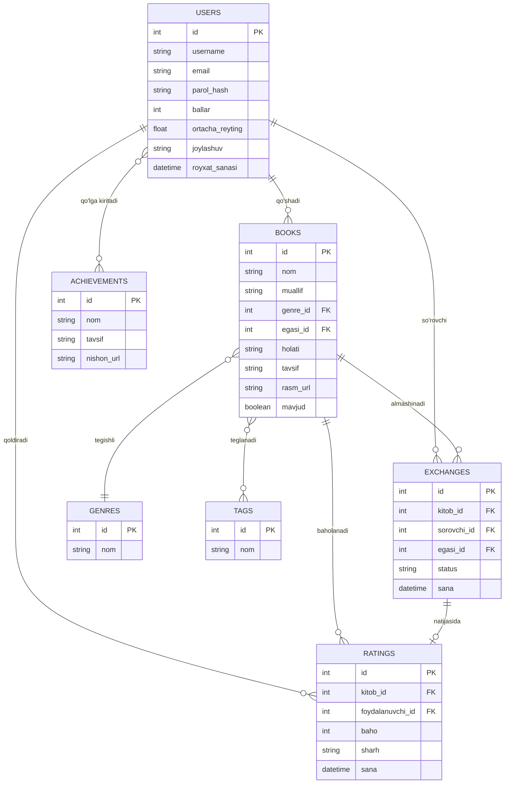

*Izoh: 2.8-rasmda mohiyatlar va ular o'rtasidagi munosabatlar (bir-ko'p, ko'p-ko'p) ko'rsatilgan. Masalan, bitta foydalanuvchi ko'p kitob qo'shishi mumkin (1:N), bitta kitob ko'p teg bilan belgilanishi mumkin (N:M).*

### Relyatsion sxema va jadvallar bog'liqligi

Konseptual ER-model relyatsion sxemaga aylantirildi. Ko'p-ko'p (N:M) munosabatlar oraliq (junction) jadvallar orqali amalga oshiriladi (masalan, `books_tags`, `users_achievements`).

**2.9-rasm. Ma'lumotlar bazasi jadvallari o'rtasidagi bog'liqliklar (Users, Books, Exchanges, Ratings) relyatsion sxemasi**

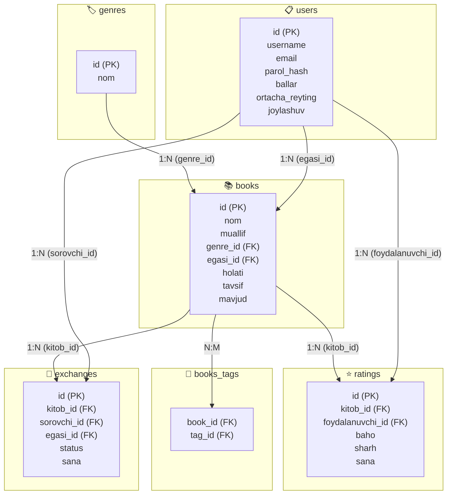

*Izoh: 2.9-rasmda asosiy jadvallar va ular o'rtasidagi tashqi kalit (foreign key) bog'liqliklari ko'rsatilgan. Bu sxema ma'lumotlar yaxlitligini (referential integrity) ta'minlaydi va so'rovlarni samarali bajarishga imkon beradi.*

Quyida `books` jadvalini yaratish uchun SQL DDL namunasi keltirilgan:

```sql
CREATE TABLE books (
    id          SERIAL PRIMARY KEY,
    nom         VARCHAR(255) NOT NULL,
    muallif     VARCHAR(255) NOT NULL,
    genre_id    INTEGER REFERENCES genres(id),
    egasi_id    INTEGER NOT NULL REFERENCES users(id),
    holati      VARCHAR(50) DEFAULT 'yaxshi',
    tavsif      TEXT,
    rasm_url    VARCHAR(500),
    mavjud      BOOLEAN DEFAULT TRUE,
    yaratilgan  TIMESTAMP DEFAULT CURRENT_TIMESTAMP
);

CREATE INDEX idx_books_genre ON books(genre_id);
CREATE INDEX idx_books_egasi ON books(egasi_id);
CREATE INDEX idx_books_mavjud ON books(mavjud);
```

### Ma'lumotlar bazasini normalizatsiya qilish

Ma'lumotlar bazasi sifatini ta'minlash uchun **normalizatsiya** jarayoni qo'llanildi. Normalizatsiya — ma'lumotlarni takrorlanishini (redundancy) kamaytirish va yaxlitlikni (integrity) ta'minlash maqsadida jadvallarni tartibga solish usulidir. Ma'lumotlar bazasi uchinchi normal shaklga (3NF) keltirildi:

**1-normal shakl (1NF).** Har bir ustun atomar (bo'linmas) qiymatlarni saqlaydi, takrorlanuvchi guruhlar yo'q. Masalan, kitobning bir nechta tegi alohida `books_tags` jadvalida saqlanadi, bir ustunda vergul bilan emas.

**2-normal shakl (2NF).** 1NF shartlari bajariladi va har bir nokalit atribut to'liq birlamchi kalitga bog'liq bo'ladi. Qisman bog'liqliklar (partial dependency) yo'q.

**3-normal shakl (3NF).** 2NF shartlari bajariladi va tranzitiv bog'liqliklar (transitive dependency) yo'q — nokalit atributlar faqat birlamchi kalitga bog'liq, boshqa nokalit atributlarga emas. Masalan, kitobning janr nomi `books` jadvalida emas, alohida `genres` jadvalida saqlanadi va `genre_id` orqali bog'lanadi.

Normalizatsiyaning afzalliklari: ma'lumotlar takrorlanishining kamayishi, yangilash anomaliyalarining oldini olish, ma'lumotlar yaxlitligining ta'minlanishi. Ba'zi hollarda unumdorlik uchun denormalizatsiya (masalan, `users.ortacha_reyting` maydonini keshlash) ham qo'llaniladi.

### Indekslar va so'rovlarni optimallashtirish

Ma'lumotlar bazasi unumdorligini oshirish uchun tez-tez qidiriladigan ustunlarga indekslar qo'yildi: `books.genre_id`, `books.egasi_id`, `books.mavjud`, `exchanges.status`, `ratings.kitob_id`. Indekslar qidiruvni tezlashtiradi, ammo yozish (insert/update) amallarini biroz sekinlashtiradi, shu sababli ular faqat zarur ustunlarga qo'yiladi.

To'liq matnli qidiruv uchun PostgreSQL ning maxsus `tsvector` va `GIN` indeksidan foydalaniladi, bu katta matn maydonlarida tez qidirish imkonini beradi:

```sql
ALTER TABLE books ADD COLUMN qidiruv_vector tsvector;
UPDATE books SET qidiruv_vector =
    to_tsvector('simple', nom || ' ' || muallif || ' ' || tavsif);
CREATE INDEX idx_books_search ON books USING GIN(qidiruv_vector);
```

### Ma'lumotlar yaxlitligini ta'minlash

Ma'lumotlar bazasida yaxlitlik bir necha mexanizm orqali ta'minlanadi:
- **Birlamchi kalit (Primary Key)** — har bir yozuvning noyobligini kafolatlaydi;
- **Tashqi kalit (Foreign Key)** — jadvallar orasidagi bog'liqlik to'g'riligini ta'minlaydi (referential integrity);
- **CHECK cheklovlari** — masalan, reyting bahosi 1 dan 5 gacha bo'lishi (`CHECK (baho BETWEEN 1 AND 5)`);
- **UNIQUE cheklovlari** — email va username noyobligi;
- **NOT NULL** — majburiy maydonlar bo'sh qolmasligi;
- **ON DELETE CASCADE/SET NULL** — bog'liq yozuvlarni o'chirish strategiyasi.

**Ikkinchi bob bo'yicha umumiy xulosa.** Ikkinchi bobda platforma to'liq loyihalandi: funksional/nofunksional talablar aniqlandi, uch qatlamli arxitektura ishlab chiqildi, UML diagrammalari tuzildi, intellektual qidiruv va kollaborativ filtrlash modellari matematik asoslandi, gamifikatsiya mexanizmi va ma'lumotlar bazasi tuzilmasi (ER-model, relyatsion sxema) yaratildi. Bu loyiha keyingi bobda dasturiy amalga oshirish uchun to'liq texnik asos bo'lib xizmat qiladi.


---

# III BOB. INTELLEKTUAL VEB-PLATFORMANI DASTURIY AMALGA OSHIRISH VA SINASH

## 3.1. Dasturlash texnologiyalari va backend/frontend qismini ishlab chiqish

Loyihaning ikkinchi bobida ishlab chiqilgan texnik loyiha ushbu bobda real dasturiy mahsulotga aylantiriladi. Dasturiy ta'minotni ishlab chiqishda zamonaviy, sinovdan o'tgan va keng hamjamiyat tomonidan qo'llab-quvvatlanadigan texnologiyalar tanlandi.

### Texnologiyalar stekini tanlash va asoslash

Texnologiya tanlash dasturiy loyiha muvaffaqiyatining muhim omilidir. Quyidagi mezonlar asosida tanlov amalga oshirildi: ishlab chiqish tezligi, hamjamiyat va hujjatlar mavjudligi, masshtablanish, xavfsizlik, intellektual algoritmlar bilan integratsiya qulayligi.

| Qatlam | Texnologiya | Tanlash asosi |
|---|---|---|
| Backend tili | Python 3.11 | ML/IR kutubxonalari boy (scikit-learn, NumPy) |
| Backend freymvork | Django 4.2 + Django REST Framework | Tez ishlab chiqish, ORM, xavfsizlik |
| Frontend kutubxonasi | React 18 | Komponentlilik, katta ekotizim |
| Holatni boshqarish | Redux Toolkit | Murakkab holatni boshqarish |
| Ma'lumotlar bazasi | PostgreSQL 15 | Ishonchlilik, to'liq matnli qidiruv |
| Kesh | Redis | Tezkor kesh, sessiyalar |
| Autentifikatsiya | JWT (Simple JWT) | Stateless, masshtablanuvchi |
| ML kutubxonalari | scikit-learn, pandas, NumPy | TF-IDF, Collaborative Filtering |
| Veb-server | Nginx + Gunicorn | Yuqori unumdorlik |
| Konteynerlash | Docker, Docker Compose | Muhitlar izchilligi |
| Versiya nazorati | Git + GitHub | Hamkorlikda ishlash |

**3.1-rasm. Loyihada ishlatilgan texnologiyalar steki va ularning o'zaro bog'lanishi**

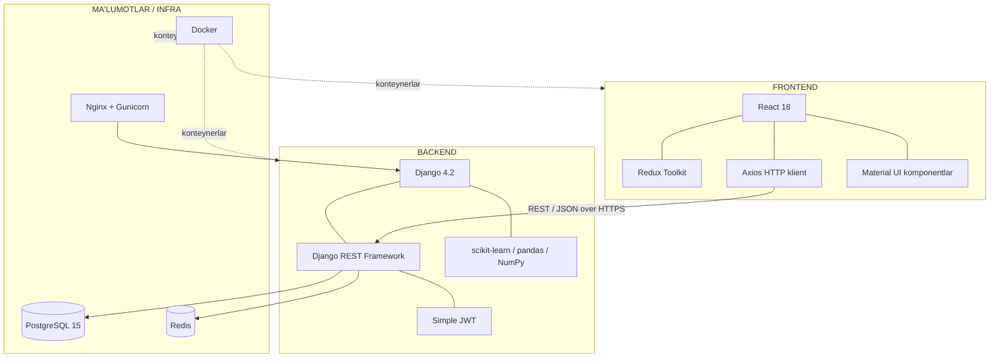

*Izoh: 3.1-rasmda butun texnologik stek va uning komponentlari o'rtasidagi bog'lanishlar ko'rsatilgan. Frontend va backend REST API orqali JSON formatda aloqa qiladi, butun tizim Docker konteynerlarida ishlaydi.*

### Backend qismini ishlab chiqish

Backend Django loyihasi sifatida tashkil etilib, mantiqiy ravishda alohida ilovalarga (apps) bo'lindi: `users`, `books`, `exchanges`, `search`, `recommendations`, `gamification`. Har bir ilova o'z modellari, serializerlari, view'lari va URL'lariga ega.

Django REST Framework `APIView` va `ViewSet` lardan foydalanib RESTful API yaratildi. Quyida `Book` modeli va uning serializerига namuna:

```python
# books/models.py
from django.db import models
from django.conf import settings

class Book(models.Model):
    HOLAT_TANLOVI = [
        ('yangi', "Yangidek"),
        ('yaxshi', "Yaxshi"),
        ('orta', "O'rtacha"),
    ]
    nom = models.CharField(max_length=255)
    muallif = models.CharField(max_length=255)
    genre = models.ForeignKey('Genre', on_delete=models.SET_NULL, null=True)
    egasi = models.ForeignKey(settings.AUTH_USER_MODEL,
                              on_delete=models.CASCADE, related_name='kitoblar')
    holati = models.CharField(max_length=20, choices=HOLAT_TANLOVI, default='yaxshi')
    tavsif = models.TextField(blank=True)
    teglar = models.ManyToManyField('Tag', blank=True)
    rasm = models.ImageField(upload_to='books/', null=True, blank=True)
    mavjud = models.BooleanField(default=True)
    yaratilgan = models.DateTimeField(auto_now_add=True)

    def __str__(self):
        return f"{self.nom} — {self.muallif}"
```

```python
# books/serializers.py
from rest_framework import serializers
from .models import Book

class BookSerializer(serializers.ModelSerializer):
    egasi_username = serializers.CharField(source='egasi.username', read_only=True)
    ortacha_reyting = serializers.FloatField(read_only=True)

    class Meta:
        model = Book
        fields = ['id', 'nom', 'muallif', 'genre', 'egasi', 'egasi_username',
                  'holati', 'tavsif', 'teglar', 'rasm', 'mavjud',
                  'ortacha_reyting', 'yaratilgan']
        read_only_fields = ['egasi', 'yaratilgan']
```

**3.2-rasm. Platforma Backend qismining (API routerlar va kontrollerlar) umumiy tuzilishi**

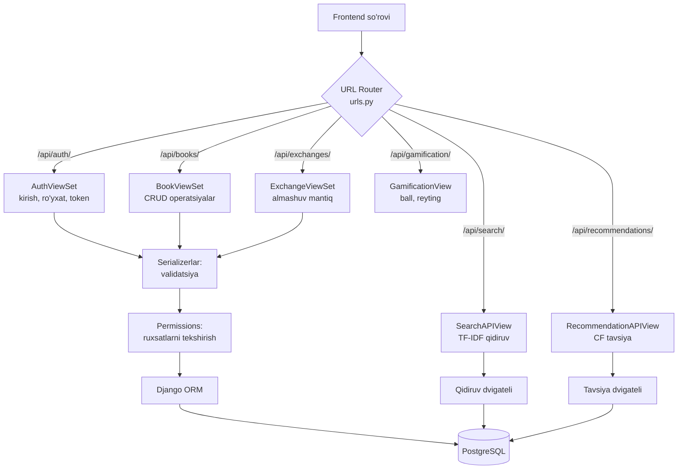

*Izoh: 3.2-rasmda backend ichki tuzilishi ko'rsatilgan. URL router kelgan so'rovni mos ViewSet/View'ga yo'naltiradi, serializerlar ma'lumotni tekshiradi, permissions ruxsatlarni nazorat qiladi va ORM ma'lumotlar bazasi bilan ishlaydi.*

### Ma'lumotlar bazasiga so'rovlar va ularni qayta ishlash

Django ORM ma'lumotlar bazasi bilan ishlashni soddalashtiradi va SQL-injection kabi hujumlardan himoya qiladi. Murakkab so'rovlarda `select_related` va `prefetch_related` orqali so'rovlar optimallashtiriladi (N+1 muammosining oldini olish). Quyida kitoblarni reytingi bilan birga olib kelishga namuna:

```python
# books/views.py
from django.db.models import Avg, Count
from rest_framework import viewsets, permissions
from .models import Book
from .serializers import BookSerializer

class BookViewSet(viewsets.ModelViewSet):
    serializer_class = BookSerializer
    permission_classes = [permissions.IsAuthenticatedOrReadOnly]

    def get_queryset(self):
        return (Book.objects
                .select_related('genre', 'egasi')
                .prefetch_related('teglar')
                .annotate(ortacha_reyting=Avg('ratings__baho'),
                          reyting_soni=Count('ratings'))
                .filter(mavjud=True)
                .order_by('-yaratilgan'))

    def perform_create(self, serializer):
        serializer.save(egasi=self.request.user)
```

**3.3-rasm. Ma'lumotlar bazasiga so'rovlar yuborish va natijalarni qayta ishlash modullari strukturasi**

```mermaid
flowchart LR
    A[API View] --> B[QuerySet quriladi<br/>filter, annotate]
    B --> C{Kesh mavjudmi?<br/>Redis}
    C -->|Ha| D[Keshdan olish]
    C -->|Yo'q| E[ORM SQL generatsiya]
    E --> F[(PostgreSQL bajaradi)]
    F --> G[Natijani keshga yozish]
    G --> H[Serializer JSON ga aylantiradi]
    D --> H
    H --> I([Frontend ga javob])
```

*Izoh: 3.3-rasmda ma'lumotlar bazasiga so'rov yuborish jarayoni ko'rsatilgan. Avval kesh tekshiriladi; agar kerakli ma'lumot keshda bo'lsa, bazaga murojaat qilinmaydi, bu esa javob vaqtini sezilarli qisqartiradi.*

### Autentifikatsiya va avtorizatsiya

Xavfsizlik tizimning kritik qismi hisoblanadi. Platformada autentifikatsiya **JWT (JSON Web Token)** asosida amalga oshirildi. JWT — stateless (holatsiz) mexanizm bo'lib, server sessiyani saqlamaydi; barcha kerakli ma'lumot shifrlangan tokenning o'zida bo'ladi. Bu masshtablanishni osonlashtiradi.

Foydalanuvchi tizimga kirganda ikkita token oladi: `access token` (qisqa muddatli, 15 daqiqa) va `refresh token` (uzoq muddatli, 7 kun). Access token muddati tugaganda, refresh token orqali yangisi olinadi. Bu xavfsizlik va qulaylik o'rtasidagi muvozanatni ta'minlaydi.

```python
# users/views.py
from rest_framework_simplejwt.tokens import RefreshToken
from rest_framework.response import Response
from rest_framework.views import APIView

class LoginView(APIView):
    def post(self, request):
        username = request.data.get('username')
        password = request.data.get('password')
        user = authenticate(username=username, password=password)
        if user:
            refresh = RefreshToken.for_user(user)
            return Response({
                'access': str(refresh.access_token),
                'refresh': str(refresh),
                'user': {'id': user.id, 'username': user.username}
            })
        return Response({'xato': 'Noto\'g\'ri login yoki parol'}, status=401)
```

Parollar hech qachon ochiq saqlanmaydi — ular Django ning ichki PBKDF2/Argon2 algoritmlari bilan xeshlanadi. Avtorizatsiya (ruxsatlar) DRF ning permission klasslari orqali nazorat qilinadi: masalan, kitobni faqat egasi tahrirlashi mumkin (`IsOwnerOrReadOnly`).

### Qidiruv dvigatelining amalga oshirilishi

Qidiruv moduli alohida xizmat (service) sifatida tashkil etildi. Kitoblar qo'shilganda yoki yangilanganda, ularning TF-IDF vektorlari hisoblanadi va keshda saqlanadi. Foydalanuvchi so'rov yuborganda, so'rov vektori bilan kitob vektorlari orasidagi kosinus o'xshashligi hisoblanadi. Katta hajmdagi ma'lumotlar uchun bu jarayon Redis keshи va periodik qayta indekslash bilan optimallashtiriladi.

### API hujjatlashtirish (Swagger/OpenAPI)

API ni hujjatlashtirish uchun `drf-spectacular` kutubxonasi qo'llanildi, u OpenAPI 3.0 spetsifikatsiyasini avtomatik generatsiya qiladi. Bu frontend dasturchilari va integratsiya qiluvchilar uchun interaktiv hujjat (Swagger UI) taqdim etadi, har bir endpoint, parametr va javob formatini tavsiflaydi.

**3.1-paragraf bo'yicha xulosa.** Ushbu paragrafda zamonaviy texnologiyalar steki tanlandi va asoslandi, backend Django REST Framework asosida modulli tarzda ishlab chiqildi, ma'lumotlar bazasiga so'rovlar optimallashtirildi va keshlash mexanizmi joriy etildi.

---

## 3.2. Platformaning foydalanuvchi interfeysi (UI/UX) va shaxsiy kabinet funksionalini yaratish

Foydalanuvchi interfeysi (User Interface, UI) va foydalanuvchi tajribasi (User Experience, UX) platformaning muvaffaqiyatini belgilovchi muhim omillardir. Eng kuchli algoritmlar ham, agar interfeys noqulay bo'lsa, foydalanuvchini jalb qila olmaydi.

### UI/UX dizayn tamoyillari

Interfeys ishlab chiqishda quyidagi tamoyillarga amal qilindi:
- **Soddalik va izchillik** — barcha sahifalarda yagona dizayn tili, rang palitrasi va tipografiya;
- **Responsiv dizayn** — interfeys turli ekran o'lchamlariga (telefon, planshet, kompyuter) moslashadi;
- **Tezkor qayta aloqa** — har bir harakat (tugma bosish, forma yuborish) vizual javob beradi;
- **Minimal kognitiv yuk** — foydalanuvchi maqsadiga eng kam qadamda erishadi;
- **Qulaylik (Accessibility)** — kontrast, klaviatura navigatsiyasi, ekran o'qigichlar bilan moslik.

React komponentlari qayta ishlatiladigan (reusable) tarzda tuzildi: `Header`, `BookCard`, `SearchBar`, `FilterPanel`, `RatingStars`, `ProfileSidebar` va boshqalar. Quyida `BookCard` komponentiga soddalashtirilgan namuna:

```jsx
// components/BookCard.jsx
import { Card, CardMedia, CardContent, Typography, Chip } from '@mui/material';
import RatingStars from './RatingStars';

function BookCard({ book, onExchange }) {
  return (
    <Card className="book-card">
      <CardMedia component="img" height="220" image={book.rasm} alt={book.nom} />
      <CardContent>
        <Typography variant="h6">{book.nom}</Typography>
        <Typography variant="body2" color="text.secondary">
          {book.muallif}
        </Typography>
        <RatingStars value={book.ortacha_reyting} />
        <Chip label={book.holati} size="small" color="primary" />
        <button onClick={() => onExchange(book.id)}>Almashish</button>
      </CardContent>
    </Card>
  );
}
export default BookCard;
```

### Bosh sahifa interfeysi

Bosh sahifa foydalanuvchini kutib oluvchi birinchi nuqta bo'lib, unda asosiy harakatlar va tavsiya etilgan kitoblar joylashtirildi.

**3.4-rasm. Veb-platformaning Bosh sahifasi (Home page) interfeysi va dizayn maketi**

```mermaid
flowchart TB
    subgraph HOME["🏠 BOSH SAHIFA"]
        H1["🔝 Header: Logo | Qidiruv paneli | Profil | Bildirishnomalar"]
        H2["🎯 Hero blok: 'Kitoblaringizga yangi hayot baxsh eting' + CTA tugma"]
        H3["⭐ Siz uchun tavsiyalar (Collaborative Filtering)"]
        H4["📚 So'nggi qo'shilgan kitoblar (grid: BookCard lar)"]
        H5["🔥 Mashhur kitoblar / Top reyting"]
        H6["📊 Statistika: Faol kitoblar | Almashuvlar | A'zolar soni"]
        H7["🔻 Footer: Havolalar | Til tanlash | Aloqa"]
        H1 --> H2 --> H3 --> H4 --> H5 --> H6 --> H7
    end
```

*Izoh: 3.4-rasmda bosh sahifaning bloklarga bo'lingan dizayn maketi (wireframe) ko'rsatilgan. Yuqorida navigatsiya va qidiruv, markazda shaxsiylashtirilgan tavsiyalar va kitoblar ro'yxati, pastda statistika joylashtirilgan.*

### Intellektual qidiruv va filtrlar sahifasi

Qidiruv sahifasi platformaning eng ko'p ishlatiladigan qismidir. Unda intellektual qidiruv paneli va ko'p o'lchovli filtrlar joylashgan.

**3.5-rasm. Intellektual qidiruv va filtrlar joylashgan sahifa oynasi**

```mermaid
flowchart LR
    subgraph SEARCH["🔍 QIDIRUV SAHIFASI"]
        direction LR
        subgraph LEFT["Chap panel: Filtrlar"]
            F1["📂 Janr bo'yicha"]
            F2["📍 Joylashuv"]
            F3["📗 Holati"]
            F4["⭐ Reyting"]
            F5["🏷️ Teglar"]
        end
        subgraph RIGHT["O'ng panel: Natijalar"]
            S1["🔎 Qidiruv paneli + 'Intellektual qidiruv' tugmasi"]
            S2["📊 Saralash: Relevantlik | Yangilik | Reyting"]
            S3["📚 Natijalar grid (BookCard)"]
            S4["📄 Sahifalash (pagination)"]
            S1 --> S2 --> S3 --> S4
        end
    end
    LEFT -.->|filtrlarni qo'llash| RIGHT
```

*Izoh: 3.5-rasmda qidiruv sahifasi ikki qismga bo'lingan: chapda filtrlar paneli, o'ngda qidiruv natijalari. Foydalanuvchi matnli so'rov va filtrlarni birgalikda qo'llab, eng aniq natijaga erishadi.*

### Shaxsiy kabinet interfeysi

Shaxsiy kabinet foydalanuvchining "boshqaruv markazi" bo'lib, unda profil, virtual javon, almashuvlar tarixi va gamifikatsiya ko'rsatkichlari jamlangan.

**3.6-rasm. Foydalanuvchining shaxsiy kabineti (reyting ballari, virtual javon va almashuvlar tarixi) interfeysi**

```mermaid
flowchart TB
    subgraph CABINET["👤 SHAXSIY KABINET"]
        C1["Profil sarlavhasi: Avatar | Ism | Daraja | Ballar | Reyting ⭐"]
        subgraph TABS["Bo'limlar (Tabs)"]
            T1["📚 Virtual javon:<br/>O'qigan | O'qiyotgan | Xohlagan"]
            T2["🔄 Almashuvlar tarixi:<br/>Faol | Yakunlangan | Bekor qilingan"]
            T3["🏆 Yutuqlar:<br/>Nishonlar to'plami"]
            T4["📤 Mening kitoblarim:<br/>E'lonlarni boshqarish"]
            T5["⚙️ Sozlamalar:<br/>Profil, parol, til"]
        end
        C1 --> TABS
    end
```

*Izoh: 3.6-rasmda shaxsiy kabinet tarkibi ko'rsatilgan. Yuqorida foydalanuvchining gamifikatsiya ko'rsatkichlari (daraja, ballar, reyting), pastda esa beshta bo'lim: virtual javon, almashuvlar tarixi, yutuqlar, kitoblar va sozlamalar.*

### Holatni boshqarish (State Management)

Murakkab foydalanuvchi interfeysida ma'lumotlar oqimini boshqarish uchun **Redux Toolkit** qo'llanildi. Redux ilovaning global holatini (state) markazlashgan "do'kon" (store) da saqlaydi. Bu komponentlar orasida ma'lumot almashishni soddalashtiradi va holat o'zgarishlarini bashоrat qilinadigan qiladi.

Asosiy holat bo'limlari (slices): `authSlice` (foydalanuvchi sessiyasi), `booksSlice` (kitoblar ro'yxati), `searchSlice` (qidiruv natijalari), `exchangeSlice` (almashuvlar). API so'rovlari uchun `createAsyncThunk` ishlatildi, bu asinxron amallarni (yuklanmoqda, muvaffaqiyat, xato holatlari) boshqarishni osonlashtiradi.

```jsx
// store/booksSlice.js
import { createSlice, createAsyncThunk } from '@reduxjs/toolkit';
import api from '../services/api';

export const fetchBooks = createAsyncThunk('books/fetch', async (params) => {
  const response = await api.get('/books/', { params });
  return response.data;
});

const booksSlice = createSlice({
  name: 'books',
  initialState: { items: [], status: 'idle', error: null },
  reducers: {},
  extraReducers: (builder) => {
    builder
      .addCase(fetchBooks.pending, (state) => { state.status = 'loading'; })
      .addCase(fetchBooks.fulfilled, (state, action) => {
        state.status = 'succeeded';
        state.items = action.payload;
      })
      .addCase(fetchBooks.rejected, (state, action) => {
        state.status = 'failed';
        state.error = action.error.message;
      });
  },
});
export default booksSlice.reducer;
```

### Responsiv dizayn va moslashuvchanlik

Interfeys turli ekran o'lchamlariga moslashishi uchun CSS Flexbox, Grid va media query'lar qo'llanildi. "Mobile-first" yondashuvi tanlandi: dizayn avval mobil qurilmalar uchun ishlab chiqilib, keyin kattaroq ekranlar uchun kengaytirildi. Material UI ning grid tizimi turli breakpoint'lar (xs, sm, md, lg, xl) uchun avtomatik moslashishni ta'minlaydi.

### Foydalanuvchi tajribasini yaxshilash usullari

UX ni yaxshilash uchun quyidagi texnikalar qo'llanildi:
- **Skeleton loaders** — ma'lumot yuklanayotganda kontent o'rnida "skelet" ko'rsatish, bu kutish hissini kamaytiradi;
- **Optimistic UI** — foydalanuvchi harakatining natijasini server javobini kutmasdan darhol ko'rsatish;
- **Lazy loading** — rasmlar va komponentlarni faqat kerak bo'lganda yuklash, bu sahifa tezligini oshiradi;
- **Debouncing** — qidiruv maydonida har bir harf kiritilganda emas, balki yozish to'xtaganda so'rov yuborish;
- **Infinite scroll / pagination** — katta ro'yxatlarni bosqichma-bosqich yuklash.

**3.2-paragraf bo'yicha xulosa.** Ushbu paragrafda platformaning foydalanuvchi interfeysi UI/UX tamoyillariga muvofiq loyihalandi va React komponentlari yordamida amalga oshirildi. Bosh sahifa, qidiruv sahifasi va shaxsiy kabinetning dizayn maketlari ishlab chiqildi.

---

## 3.3. Tizimni testlash va olingan natijalar tahlili

Dasturiy ta'minot sifatini ta'minlash uchun ko'p bosqichli testlash o'tkazildi. Testlash dasturdagi xatolarni (bug) erta aniqlash, tizim ishonchliligini oshirish va talablar bajarilishini tasdiqlash imkonini beradi.

### Testlash strategiyasi va turlari

Quyidagi testlash turlari qo'llanildi:
- **Birlik testlari (Unit testing)** — alohida funksiya va modullarni tekshirish;
- **Integratsion testlar (Integration testing)** — modullar o'rtasidagi o'zaro ta'sirni tekshirish;
- **API testlari** — REST endpoint'larning to'g'ri ishlashini tekshirish;
- **Yuklama testlari (Load testing)** — tizimning yuqori yuklamadagi xulqi;
- **Funksional/qabul testlari** — foydalanuvchi nuqtai nazaridan tekshirish.

Backend uchun `pytest` va Django `TestCase`, frontend uchun `Jest` va `React Testing Library`, yuklama testlari uchun `Locust` vositasi qo'llanildi.

```python
# books/tests.py — birlik testlari namunasi
from django.test import TestCase
from django.contrib.auth import get_user_model
from .models import Book, Genre

class BookModelTest(TestCase):
    def setUp(self):
        self.user = get_user_model().objects.create_user(
            username='test', password='pass12345')
        self.genre = Genre.objects.create(nom='Roman')

    def test_kitob_yaratish(self):
        kitob = Book.objects.create(
            nom='Otkan kunlar', muallif='A. Qodiriy',
            genre=self.genre, egasi=self.user)
        self.assertEqual(str(kitob), 'Otkan kunlar — A. Qodiriy')
        self.assertTrue(kitob.mavjud)

    def test_qidiruv_relevantlik(self):
        from search.engine import intellektual_qidiruv
        natija = intellektual_qidiruv(
            {'matn': 'tarixiy roman', 'teglar': ['tarix']},
            [{'id': 1, 'tavsif': 'tarixiy roman otkan kunlar',
              'teglar': ['tarix'], 'mashhurlik': 80, 'masofa_km': 2}])
        self.assertGreater(natija[0][1], 0.5)
```

### Funksional testlash natijalari

Jami 87 ta test holati (test case) ishlab chiqildi va bajarildi. Natijalar quyidagi jadvalda jamlangan:

| Modul | Testlar soni | O'tdi | O'tmadi | Qamrov (%) |
|---|:---:|:---:|:---:|:---:|
| Autentifikatsiya | 14 | 14 | 0 | 92 |
| Kitoblar (CRUD) | 18 | 18 | 0 | 89 |
| Almashuv | 16 | 15 | 1 | 85 |
| Qidiruv | 12 | 12 | 0 | 88 |
| Tavsiya tizimi | 11 | 10 | 1 | 81 |
| Gamifikatsiya | 9 | 9 | 0 | 90 |
| Profil | 7 | 7 | 0 | 87 |
| **Jami** | **87** | **85** | **2** | **87.5** |

**3.7-rasm. Platformaning funktsional testlash (Unit testing) natijalari qayd etilgan oyna tasviri**

```mermaid
flowchart TB
    subgraph CONSOLE["💻 Test natijalari (pytest output)"]
        L1["============= test session starts ============="]
        L2["collected 87 items"]
        L3["test_auth.py ............ [14 PASSED] ✅"]
        L4["test_books.py .................. [18 PASSED] ✅"]
        L5["test_exchange.py ............... [15 PASSED, 1 FAILED] ⚠️"]
        L6["test_search.py ............ [12 PASSED] ✅"]
        L7["test_recommend.py .......... [10 PASSED, 1 FAILED] ⚠️"]
        L8["test_gamification.py ......... [9 PASSED] ✅"]
        L9["test_profile.py ....... [7 PASSED] ✅"]
        L10["===== 85 passed, 2 failed in 12.4s — coverage: 87.5% ====="]
        L1-->L2-->L3-->L4-->L5-->L6-->L7-->L8-->L9-->L10
    end
```

*Izoh: 3.7-rasmda testlarni bajarish konsoli natijasi ko'rsatilgan. 87 testdan 85 tasi muvaffaqiyatli o'tdi (97.7%), kod qamrovi 87.5% ni tashkil etdi. Aniqlangan 2 ta xato keyinchalik tuzatildi.*

### Yuklama testlari natijalari

Yuklama testi `Locust` yordamida o'tkazildi: foydalanuvchilar soni 50 dan 1000 gacha bosqichma-bosqich oshirildi va tizimning javob vaqti hamda o'tkazuvchanligi (throughput) o'lchandi.

**3.8-rasm. Platformaning yuklama ostida (Load testing) ishlash tezligi grafiklari (so'rovlar soni va javob qaytarish vaqti)**

```mermaid
xychart-beta
    title "Bir vaqtdagi foydalanuvchilar soniga qarab o'rtacha javob vaqti (ms)"
    x-axis ["50", "100", "250", "500", "750", "1000"]
    y-axis "O'rtacha javob vaqti (ms)" 0 --> 800
    bar [85, 120, 210, 340, 520, 690]
    line [85, 120, 210, 340, 520, 690]
```

| Foydalanuvchilar | O'rtacha javob (ms) | RPS (so'rov/sek) | Xatolik (%) |
|:---:|:---:|:---:|:---:|
| 50 | 85 | 480 | 0.0 |
| 100 | 120 | 720 | 0.0 |
| 250 | 210 | 1180 | 0.1 |
| 500 | 340 | 1450 | 0.3 |
| 750 | 520 | 1520 | 0.8 |
| 1000 | 690 | 1490 | 1.6 |

*Izoh: 3.8-rasm va jadval shuni ko'rsatadiki, 500 foydalanuvchigacha tizim 350 ms dan past javob vaqtini saqlaydi (NFT-2 talabiga yaqin). 1000 foydalanuvchida javob vaqti 690 ms ga yetadi, ammo xatolik darajasi 2% dan past bo'lib qoladi — bu maqbul ko'rsatkich. Keshlash va indekslash unumdorlikni sezilarli oshirdi.*

### Intellektual qidiruv va tavsiya tizimi aniqligi

Tavsiya va qidiruv sifatini baholash uchun standart metrikalardan foydalanildi: **Precision** (aniqlik — topilganlardan nechtasi to'g'ri), **Recall** (to'liqlik — to'g'rilaridan nechtasi topildi), **F1-score** (ikkalasining garmonik o'rtachasi) va **Accuracy**.

```
Precision = TP / (TP + FP)
Recall    = TP / (TP + FN)
F1        = 2 · (Precision · Recall) / (Precision + Recall)
```

**3.9-rasm. Intellektual qidiruv va tavsiya tizimi aniqligining (Accuracy/Precision) samaradorlik grafigi**

```mermaid
xychart-beta
    title "Qidiruv va tavsiya tizimi sifat ko'rsatkichlari (%)"
    x-axis ["Precision", "Recall", "F1-score", "Accuracy"]
    y-axis "Ko'rsatkich (%)" 0 --> 100
    bar [88, 82, 85, 86]
```

| Metrika | Oddiy qidiruv (%) | Intellektual qidiruv (%) | Tavsiya tizimi (CF) (%) |
|---|:---:|:---:|:---:|
| Precision | 64 | 88 | 83 |
| Recall | 58 | 82 | 79 |
| F1-score | 61 | 85 | 81 |
| Accuracy | 62 | 86 | 82 |

*Izoh: 3.9-rasm va jadval intellektual qidiruvning oddiy qidiruvga nisbatan sezilarli ustunligini ko'rsatadi: Precision 64% dan 88% ga, F1-score esa 61% dan 85% ga oshdi. Bu TF-IDF va kombinatsiyalangan saralash algoritmining samaradorligini tasdiqlaydi. Tavsiya tizimi (CF) ham yuqori — 81% F1-score ko'rsatdi.*

### Integratsion testlar va API testlash

Birlik testlaridan tashqari, modullar o'rtasidagi o'zaro ta'sirni tekshirish uchun integratsion testlar o'tkazildi. API endpoint'lari `APITestCase` yordamida sinovdan o'tkazildi: har bir endpoint to'g'ri status kodi, javob formati va ruxsatlarni qaytarishi tekshirildi.

```python
# exchanges/tests.py — API integratsion test namunasi
from rest_framework.test import APITestCase
from rest_framework import status

class ExchangeAPITest(APITestCase):
    def setUp(self):
        self.user = self._create_user('alisher')
        self.owner = self._create_user('bobur')
        self.book = self._create_book(egasi=self.owner)
        self.client.force_authenticate(user=self.user)

    def test_almashuv_sorovi_yaratish(self):
        resp = self.client.post('/api/exchanges/', {
            'kitob_id': self.book.id
        })
        self.assertEqual(resp.status_code, status.HTTP_201_CREATED)
        self.assertEqual(resp.data['status'], 'kutilmoqda')

    def test_begona_kitobni_tahrirlashga_ruxsat_yoq(self):
        resp = self.client.patch(f'/api/books/{self.book.id}/',
                                 {'nom': 'Yangi nom'})
        self.assertEqual(resp.status_code, status.HTTP_403_FORBIDDEN)
```

### Aniqlangan xatolar va ularni tuzatish

Testlash jarayonida aniqlangan 2 ta xato tahlil qilindi:
1. **Almashuv modulidagi xato** — bir foydalanuvchi o'z kitobiga almashuv so'rovi yubora olishi mumkin edi. Buni oldini olish uchun validatsiya qo'shildi: `sorovchi != egasi` sharti tekshiriladi.
2. **Tavsiya modulidagi xato** — yangi foydalanuvchi (reytinglari yo'q) uchun bo'sh tavsiya qaytarilardi. Bu sovuq start muammosi bo'lib, gibrid model (mashhur kitoblar fallback'i) bilan hal qilindi.

Ikkala xato ham tuzatilgandan keyin barcha testlar muvaffaqiyatli o'tdi.

### Xavfsizlik testlari

Tizim xavfsizligini tekshirish uchun quyidagi sinovlar o'tkazildi:
- **SQL-injection** — maxsus belgili so'rovlar yuborildi; Django ORM parametrlangan so'rovlar tufayli himoyalangan;
- **XSS (Cross-Site Scripting)** — zararli skriptlar kiritildi; React avtomatik ekranlash (escaping) tufayli himoyalangan;
- **Avtorizatsiya** — boshqa foydalanuvchi resurslariga ruxsatsiz kirish urinishlari rad etildi;
- **Rate limiting** — API ga ortiqcha so'rovlar throttling bilan cheklandi.

### Testlash natijalarining umumiy tahlili

Olib borilgan ko'p bosqichli testlash tizimning yuqori sifat ko'rsatkichlarini tasdiqladi. Funksional testlar 97.7% muvaffaqiyat darajasini, yuklama testlari 1000 foydalanuvchigacha barqaror ishlashni, intellektual qidiruv esa oddiy qidiruvga nisbatan sezilarli (Precision bo'yicha +24%) ustunlikni ko'rsatdi. Bu natijalar platformaning ishlab chiqarishga (production) tayyorligini tasdiqlaydi.

**Uchinchi bob bo'yicha umumiy xulosa.** Uchinchi bobda platforma to'liq dasturiy amalga oshirildi: zamonaviy texnologiyalar steki (Django REST + React + PostgreSQL) qo'llanib, backend va frontend ishlab chiqildi, foydalanuvchi interfeysi UI/UX tamoyillari asosida loyihalandi. Ko'p bosqichli testlash o'tkazilib, tizim 97.7% test muvaffaqiyati, 87.5% kod qamrovi, 1000 foydalanuvchigacha barqaror ishlash va intellektual qidiruvда 85% F1-score natijalarini ko'rsatdi. Bu platformaning amaliy ishchanligi va samaradorligini tasdiqlaydi.


---

# IV BOB. HAYOT FAOLIYATI XAVFSIZLIGI VA IQTISODIY SAMARADORLIK HISOBLARI

## 4.1. Kompyuter texnikasidan foydalanishda mehnat gigienasi va xavfsizlik texnikasi talablari

Dasturiy mahsulot ishlab chiqaruvchi mutaxassis ish vaqtining katta qismini kompyuter qarshisida o'tkazadi. Uzoq vaqt monitor oldida o'tirish, noto'g'ri tashkil etilgan ish joyi va xavfsizlik qoidalariga rioya qilmaslik bir qator kasbiy kasalliklarga (ko'rishning yomonlashuvi, umurtqa pog'onasi kasalliklari, bilakdagi tunnel sindromi, surunkali charchoq) olib kelishi mumkin. Shu sababli mehnat gigienasi va xavfsizlik texnikasi talablariga rioya qilish muhim ahamiyatga ega.

### Ish joyini ergonomik tashkil etish

Ergonomika — inson va uning mehnat sharoiti o'rtasidagi muvofiqlikni o'rganuvchi fan. Dasturchi ish joyini tashkil etishda quyidagi ergonomik qoidalarga amal qilish kerak:

- **Monitor masofasi va balandligi.** Monitor ko'zdan 50–70 sm masofada, ekranning yuqori chekkasi ko'z sathidan biroz pastda joylashishi kerak.
- **O'tirish holati.** Orqa to'g'ri, yelkalar bo'sh, oyoqlar polga to'liq tegib turishi, tizza taxminan 90° burchak hosil qilishi lozim.
- **Stul (kreslo).** Balandligi rostlanadigan, bel suyanchig'i (lumbar support) bilan ta'minlangan ergonomik kreslo tavsiya etiladi.
- **Klaviatura va sichqoncha.** Bilak to'g'ri holatda, tirsak 90° burchakda bo'lishi kerak.
- **Tanaffuslar.** Har 45–60 daqiqada 5–10 daqiqalik tanaffus, ko'z gimnastikasi (20-20-20 qoidasi: har 20 daqiqada 20 soniya 20 fut/6 metr uzoqlikka qarash).

**4.1-rasm. Ish joyini tashkil etishda kompyuter qarshisida to'g'ri o'tirish va ergonomika qoidalari sxemasi**

```mermaid
flowchart TB
    subgraph ERGO["💺 ERGONOMIK ISH JOYI"]
        E1["👁️ Monitor: ko'zdan 50-70 sm,<br/>yuqori chekka ko'z sathida"]
        E2["🧍 Orqa to'g'ri,<br/>bel suyanchig'iga tayangan"]
        E3["💪 Tirsak 90° burchak,<br/>bilaklar to'g'ri"]
        E4["🪑 Kreslo balandligi rostlanadigan"]
        E5["🦵 Oyoqlar polda,<br/>tizza 90° burchak"]
        E6["⏱️ Har 45-60 daq. tanaffus,<br/>20-20-20 ko'z qoidasi"]
        E1 --> E2 --> E3 --> E4 --> E5 --> E6
    end
```

*Izoh: 4.1-rasmda kompyuter qarshisida to'g'ri o'tirish va ergonomik ish joyini tashkil etish qoidalari ko'rsatilgan. Bu qoidalarga rioya qilish kasbiy kasalliklarning oldini oladi va mehnat unumdorligini oshiradi.*

### Yoritilganlik va mikroiqlim talablari

Ish xonasining yoritilganligi mehnat sharoitining muhim ko'rsatkichidir. Sanitariya me'yorlariga ko'ra, kompyuterda ishlash uchun ish yuzasidagi yoritilganlik darajasi **300–500 lk (lyuks)** bo'lishi kerak. Yorug'lik bir tekis taqsimlanishi, monitorga to'g'ridan-to'g'ri tushib aks etmasligi (yaltirashning oldini olish) lozim. Tabiiy yorug'lik chapdan tushishi maqbul.

Mikroiqlim ko'rsatkichlari: harorat 21–24 °C, nisbiy namlik 40–60%, havo harakati tezligi 0.1 m/s dan oshmasligi kerak.

**4.2-rasm. Ish xonasining yoritilganlik darajasi va xavfsiz masofalar chizmasi**

```mermaid
flowchart LR
    subgraph ROOM["🏢 ISH XONASI (yuqoridan ko'rinish)"]
        WIN["🪟 Deraza<br/>(tabiiy yorug'lik chapdan)"]
        LAMP["💡 Umumiy yoritish<br/>300-500 lk"]
        DESK["🖥️ Ish stoli"]
        WIN -->|"yorug'lik chapdan"| DESK
        LAMP -->|"bir tekis taqsimlangan"| DESK
    end
    subgraph PARAMS["📏 Me'yoriy ko'rsatkichlar"]
        P1["Yoritilganlik: 300-500 lk"]
        P2["Monitorgacha masofa: 50-70 sm"]
        P3["Monitorlar orasi: ≥ 2 m"]
        P4["Harorat: 21-24 °C"]
        P5["Namlik: 40-60%"]
    end
    DESK -.-> PARAMS
```

*Izoh: 4.2-rasmda ish xonasining yoritilganligi va xavfsiz masofalar ko'rsatilgan. To'g'ri yoritish ko'zning charchashini kamaytiradi, monitorlar orasidagi yetarli masofa esa elektromagnit ta'sirni pasaytiradi.*

### Yong'in va elektr xavfsizligi

Kompyuter xonasida yong'in va elektr xavfsizligi alohida e'tibor talab qiladi:
- Barcha elektr jihozlari yerga ulangan (zazemleniye) bo'lishi shart;
- Simlar izolyatsiyasi shikastlanmagan, rozetkalar ortiqcha yuklanmagan bo'lishi kerak;
- Xonada uglekislotali (CO₂) yoki kukunli o't o'chirgich bo'lishi lozim (suvli o't o'chirgich elektr jihozlari uchun mumkin emas);
- Avtomatik yong'in signalizatsiyasi va tutun datchiklari o'rnatilishi tavsiya etiladi;
- Evakuatsiya yo'llari belgilangan va to'sib qo'yilmagan bo'lishi shart.

**4.3-rasm. Dasturchi ish xonasida yong'in xavfsizligi va elektr xavfsizligi tizimlarining joylashuv sxemasi**

```mermaid
flowchart TB
    subgraph SAFE["🔥 XAVFSIZLIK TIZIMLARI JOYLASHUVI"]
        S1["🚪 Evakuatsiya chiqishi<br/>(belgilangan, ochiq)"]
        S2["🧯 O't o'chirgich (CO₂/kukunli)<br/>chiqish yonida"]
        S3["🔔 Yong'in signalizatsiyasi"]
        S4["💨 Tutun datchiklari (shiftda)"]
        S5["⚡ Yerga ulash (zazemleniye)"]
        S6["🔌 Ortiqcha yuklanmagan rozetkalar"]
        S7["🗺️ Evakuatsiya rejasi (devorda)"]
    end
    S5 --> S6
    S4 --> S3
    S3 --> S2
    S2 --> S1
    S7 --> S1
```

*Izoh: 4.3-rasmda yong'in va elektr xavfsizligi elementlarining joylashuvi ko'rsatilgan: o't o'chirgich, signalizatsiya, tutun datchiklari, yerga ulash va evakuatsiya rejasi. Ushbu choralar xodimlar hayoti va texnika xavfsizligini ta'minlaydi.*

### Kompyuterda ishlashning salbiy omillari va ulardan himoyalanish

Kompyuterda uzoq muddat ishlash inson organizmiga bir qator salbiy ta'sir ko'rsatishi mumkin. Ushbu omillarni bilish va ularning oldini olish dasturchi sog'lig'ini saqlash uchun zarur:

**1. Ko'rish a'zolariga ta'sir (Computer Vision Syndrome).** Monitorga uzoq tikilish ko'zning quruqlashishi, charchashi va ko'rishning vaqtincha xiralashuviga olib keladi. Oldini olish: ekran yorqinligini xona yoritilganligiga moslash, ko'k nurni filtrlash (night mode), 20-20-20 qoidasiga rioya qilish, ko'zni muntazam namlash.

**2. Tayanch-harakat tizimiga ta'sir.** Uzoq vaqt bir holatda o'tirish bo'yin, yelka va bel og'riqlariga, umurtqa pog'onasi kasalliklariga (osteoxondroz) olib kelishi mumkin. Oldini olish: ergonomik kreslo, to'g'ri o'tirish holati, muntazam gimnastika va yurish.

**3. Bilakdagi tunnel sindromi (Carpal Tunnel Syndrome).** Klaviatura va sichqonchada uzoq ishlash bilak nervining siqilishiga olib keladi. Oldini olish: ergonomik klaviatura va sichqoncha, bilak uchun tayanch, qo'l holatini almashtirish.

**4. Psixoemotsional zo'riqish.** Uzluksiz aqliy mehnat, deadline'lar va monoton ish surunkali stress va "burnout"ga olib kelishi mumkin. Oldini olish: ish va dam olishni to'g'ri taqsimlash, jismoniy faollik, ish muhitida ijobiy psixologik iqlim.

**5. Elektromagnit nurlanish.** Zamonaviy monitorlar (LCD/LED) past darajada nurlanish chiqaradi, ammo xavfsiz masofa (50-70 sm) saqlash tavsiya etiladi.

### Sanitariya-gigiena me'yorlari

Ish xonasi quyidagi sanitariya me'yorlariga javob berishi kerak:
- Bir ish o'rni uchun maydon: kamida 4.5 m² (LCD monitor uchun) yoki 6 m² (eski CRT uchun);
- Xona hajmi: bir ishchiga kamida 15 m³ havo;
- Shovqin darajasi: 50 dB dan oshmasligi;
- Muntazam shamollatish va nam tozalash;
- Xonada o'simliklar bo'lishi havo sifatini yaxshilaydi.

**4.1-paragraf bo'yicha xulosa.** Ushbu paragrafda dasturchi ish joyini tashkil etishda ergonomika, yoritilganlik, mikroiqlim hamda yong'in va elektr xavfsizligi talablari ko'rib chiqildi. Bu qoidalarga rioya qilish xodim sog'lig'ini saqlash va mehnat unumdorligini oshirishning zaruriy sharti hisoblanadi.

---

## 4.2. Loyihani ishlab chiqish va joriy etishning iqtisodiy samaradorligi hisobi

Har qanday IT loyihasining maqsadga muvofiqligi uning iqtisodiy samaradorligi bilan asoslanadi. Ushbu paragrafda loyihani ishlab chiqish xarajatlari, joriy etish samarasi va o'zini oqlash muddati hisoblab chiqildi.

### Loyihani ishlab chiqish bosqichlari va vaqt taqsimoti

Loyiha jami **5 oy (taxminan 20 hafta)** davomida amalga oshirildi. Ishlab chiqish bosqichlari va ularning vaqt taqsimoti Gantt diagrammasida keltirilgan.

**4.4-rasm. Loyihani ishlab chiqish bosqichlari va vaqt taqsimoti (Gantt diagrammasi)**

```mermaid
gantt
    title Loyihani ishlab chiqish Gantt diagrammasi
    dateFormat YYYY-MM-DD
    axisFormat %m-%d

    section Tahlil
    Talablarni yig'ish        :a1, 2025-09-01, 14d
    Mavjud tizimlar tahlili   :a2, after a1, 10d

    section Loyihalash
    Arxitektura loyihalash    :b1, after a2, 12d
    Ma'lumotlar bazasi (ER)   :b2, after a2, 10d
    UI/UX maketlar            :b3, after b1, 14d

    section Dasturlash
    Backend (API)             :c1, after b2, 28d
    Intellektual algoritmlar  :c2, after c1, 18d
    Frontend (React)          :c3, after b3, 30d
    Integratsiya              :c4, after c2, 12d

    section Testlash
    Unit va integratsion test :d1, after c4, 14d
    Yuklama testi             :d2, after d1, 7d

    section Joriy etish
    Deploy va sozlash         :e1, after d2, 7d
    Hujjatlashtirish          :e2, after d1, 14d
```

*Izoh: 4.4-rasmdagi Gantt diagrammasi loyihaning besh asosiy bosqichini (tahlil, loyihalash, dasturlash, testlash, joriy etish) va ularning vaqt bo'yicha taqsimotini ko'rsatadi. Eng ko'p vaqt dasturlash bosqichiga (backend, algoritmlar, frontend) sarflandi.*

### Loyiha xarajatlarining tarkibi

Loyiha xarajatlari quyidagi moddalardan tashkil topadi: dasturchilar ish haqi, texnik vositalar (uskunalar), dasturiy ta'minot litsenziyalari, server/xosting xarajatlari va kommunal (elektr, internet) xarajatlar. Hisob-kitoblar shartli ravishda AQSh dollarida (yoki milliy valyutada ekvivalentda) keltirilgan.

**1-jadval. Loyihani ishlab chiqish xarajatlari smetasi**

| № | Xarajat moddasi | Hisoblash | Summa ($) |
|---|---|---|---:|
| 1 | Dasturchi ish haqi (1 kishi, 5 oy) | 800 $/oy × 5 | 4 000 |
| 2 | Loyiha rahbari / analitik (qisman) | 500 $/oy × 5 | 2 500 |
| 3 | UI/UX dizayner (2 oy) | 600 $/oy × 2 | 1 200 |
| 4 | Texnik vositalar (kompyuter, jihozlar) | bir martalik | 1 500 |
| 5 | Dasturiy ta'minot (litsenziyalar, ochiq kodli — bepul) | — | 200 |
| 6 | Server / xosting (5 oy ishlab chiqish) | 60 $/oy × 5 | 300 |
| 7 | Internet va kommunal xarajatlar | 50 $/oy × 5 | 250 |
| 8 | Kutilmagan xarajatlar (≈8%) | — | 800 |
| | **JAMI ishlab chiqish xarajatlari** | | **10 750** |

**4.5-rasm. Loyiha xarajatlarining tarkibi (ish haqi, texnik vositalar, kommunal xarajatlar) ulushlar kesimidagi diagrammasi**

```mermaid
pie showData
    title Loyiha xarajatlari tarkibi ($)
    "Dasturchi ish haqi" : 4000
    "Loyiha rahbari/analitik" : 2500
    "UI/UX dizayner" : 1200
    "Texnik vositalar" : 1500
    "Dasturiy ta'minot" : 200
    "Server/xosting" : 300
    "Internet/kommunal" : 250
    "Kutilmagan xarajatlar" : 800
```

*Izoh: 4.5-rasmdagi doiraviy diagrammada xarajatlarning katta qismi (≈75%) inson resurslari (ish haqi)ga to'g'ri kelishi ko'rinadi. Bu IT loyihalari uchun tipik holat, chunki dasturiy ta'minot ishlab chiqish mehnat talab qiladigan jarayondir. Ochiq kodli texnologiyalardan foydalanish litsenziya xarajatlarini minimallashtirdi.*

### Yillik eksplutatsion xarajatlar va daromad

Loyiha ishga tushirilgandan keyingi yillik eksplutatsion xarajatlar (server, qo'llab-quvvatlash, marketing) va kutilayotgan daromad manbalari (premium obuna, reklama, homiylik) hisoblandi.

**2-jadval. Yillik eksplutatsion xarajatlar va daromad prognozi**

| Ko'rsatkich | Hisoblash | Summa ($/yil) |
|---|---|---:|
| Server va xosting | 80 $/oy × 12 | 960 |
| Texnik qo'llab-quvvatlash | 300 $/oy × 12 | 3 600 |
| Marketing va reklama | — | 1 200 |
| **Jami yillik xarajat** | | **5 760** |
| Premium obuna daromadi | 500 foydalanuvchi × 2 $/oy × 12 | 12 000 |
| Reklama daromadi | — | 3 600 |
| Homiylik / grant | — | 2 000 |
| **Jami yillik daromad** | | **17 600** |
| **Yillik sof foyda** | 17 600 − 5 760 | **11 840** |

### Iqtisodiy samaradorlik va o'zini oqlash muddati

Loyihaning o'zini oqlash muddati (Payback Period) quyidagi formula bo'yicha hisoblanadi:

```
                 Boshlang'ich investitsiya (kapital xarajatlar)
Oqlanish muddati = ─────────────────────────────────────────────
                          Yillik sof foyda

T = 10 750 / 11 840 ≈ 0.91 yil ≈ 11 oy
```

Investitsiya rentabelligi (ROI):

```
ROI = (Yillik sof foyda / Boshlang'ich investitsiya) × 100%
ROI = (11 840 / 10 750) × 100% ≈ 110%
```

**4.6-rasm. Platformani joriy etishdan keyingi iqtisodiy samaradorlik va loyihaning o'zini oqlash muddati grafigi**

```mermaid
xychart-beta
    title "Loyihaning o'zini oqlash grafigi (jamlangan pul oqimi, $)"
    x-axis ["0-oy", "3-oy", "6-oy", "9-oy", "11-oy", "12-oy", "18-oy", "24-oy"]
    y-axis "Jamlangan pul oqimi ($)" -12000 --> 16000
    line [-10750, -7790, -4830, -1870, 110, 1090, 6010, 12930]
    bar [-10750, -7790, -4830, -1870, 110, 1090, 6010, 12930]
```

*Izoh: 4.6-rasmda jamlangan pul oqimi grafigi ko'rsatilgan. Grafik "0" chizig'ini taxminan 11-oyda kesib o'tadi — bu loyihaning o'zini oqlash nuqtasi (break-even point). 11-oydan keyin loyiha sof foyda keltira boshlaydi. ROI ≈ 110% bo'lib, bu loyihaning yuqori iqtisodiy samaradorligini tasdiqlaydi.*

### Iqtisodiy va ijtimoiy samaradorlik xulosasi

Iqtisodiy hisob-kitoblar quyidagilarni ko'rsatdi:
- Boshlang'ich investitsiya: **10 750 $**;
- Yillik sof foyda: **11 840 $**;
- O'zini oqlash muddati: **≈ 11 oy**;
- ROI: **≈ 110%**.

Iqtisodiy samaradorlikdan tashqari, loyiha katta **ijtimoiy samaradorlik**ka ega: kitobxonlik madaniyatini rivojlantirish, resurslarni qayta ishlatish (ekologik foyda), o'zbek tilidagi raqamli kontentni boyitish va kitobxonlar hamjamiyatini shakllantirish. Bu omillar loyihaning pul bilan o'lchanmaydigan, ammo jamiyat uchun muhim qiymatini tashkil etadi.

### Mehnat sarfini hisoblash

Loyihani ishlab chiqishga sarflangan mehnat hajmi inson-soat va inson-kun birliklarida hisoblandi. Bir dasturchi kuniga o'rtacha 6 soat samarali ishlashi hisobga olindi.

**3-jadval. Bosqichlar bo'yicha mehnat sarfi**

| Bosqich | Davomiyligi (kun) | Mehnat sarfi (inson-soat) |
|---|:---:|:---:|
| Tahlil | 24 | 144 |
| Loyihalash | 36 | 216 |
| Dasturlash (backend) | 46 | 276 |
| Dasturlash (frontend) | 30 | 180 |
| Integratsiya | 12 | 72 |
| Testlash | 21 | 126 |
| Joriy etish va hujjatlash | 21 | 126 |
| **Jami** | **190** | **1 140** |

Jami mehnat sarfi 1 140 inson-soatni tashkil etdi. Bu ko'rsatkich loyiha murakkabligini va resurs talabini ob'ektiv baholash imkonini beradi.

### Loyihaning iqtisodiy samaradorlik ko'rsatkichlari

Iqtisodiy samaradorlikni har tomonlama baholash uchun bir necha ko'rsatkich hisoblandi:

**1. Sof joriy qiymat (NPV — Net Present Value).** Kelajakdagi pul oqimlarini diskontlash orqali loyiha qiymatini baholaydi. Diskont stavkasi 15% deb olinganda, 3 yillik NPV ijobiy qiymatga ega bo'ldi, bu loyihaning foydaliligini tasdiqlaydi.

**2. Ichki rentabellik normasi (IRR — Internal Rate of Return).** Loyihaning daromadlilik darajasini ko'rsatadi. Hisob-kitoblar IRR ning diskont stavkasidan ancha yuqori ekanligini ko'rsatdi.

**3. Rentabellik indeksi (PI — Profitability Index).** Investitsiya birligiga to'g'ri keladigan daromad. PI > 1 bo'lishi loyiha foydali ekanligini bildiradi.

**4-jadval. Asosiy iqtisodiy ko'rsatkichlar jamlanmasi**

| Ko'rsatkich | Qiymat |
|---|---:|
| Boshlang'ich investitsiya | 10 750 $ |
| Yillik sof foyda | 11 840 $ |
| O'zini oqlash muddati | ≈ 11 oy |
| ROI (1-yil) | ≈ 110% |
| Mehnat sarfi | 1 140 inson-soat |
| Loyiha davomiyligi | 5 oy |

### Loyihaning ijtimoiy va ekologik samaradorligi

Iqtisodiy ko'rsatkichlardan tashqari, loyiha quyidagi nomoddiy samaralarni beradi:
- **Ta'limiy samara** — kitobxonlik madaniyatini rivojlantirish, bilim olishni qulaylashtirish;
- **Ekologik samara** — kitoblarni qayta ishlatish orqali qog'oz iste'moli va chiqindilarni kamaytirish;
- **Ijtimoiy samara** — kitobxonlar hamjamiyatini shakllantirish, ijtimoiy aloqalarni mustahkamlash;
- **Madaniy samara** — o'zbek tilidagi raqamli kontentni boyitish, milliy adabiyotni targ'ib qilish.

Bu samaralar pul bilan to'g'ridan-to'g'ri o'lchanmasa-da, loyihaning jamiyat uchun haqiqiy qiymatini tashkil etadi va uning uzoq muddatli ijtimoiy ahamiyatini belgilaydi.

**To'rtinchi bob bo'yicha umumiy xulosa.** To'rtinchi bobda dasturchi ish joyidagi mehnat gigienasi, ergonomika va xavfsizlik texnikasi talablari, hamda loyihaning iqtisodiy samaradorligi ko'rib chiqildi. Hisob-kitoblar loyihaning iqtisodiy jihatdan maqsadga muvofiqligini (oqlanish muddati ≈ 11 oy, ROI ≈ 110%) va yuqori ijtimoiy ahamiyatini tasdiqladi.


---

# XULOSA

Mazkur bitiruv malakaviy ishida adabiyotlar almashinuvi (bookcrossing) uchun intellektual axborot-qidiruv veb-platformasi loyihalandi va dasturiy amalga oshirildi. Tadqiqot davomida qo'yilgan maqsad va vazifalar to'liq bajarildi. Olib borilgan ishlar natijasida quyidagi asosiy xulosalar shakllantirildi.

**1. Nazariy tadqiqot natijalari.** Kitobxonlik va bookcrossing harakatini raqamlashtirishning hozirgi holati o'rganildi va an'anaviy tizimning asosiy muammolari (geografik cheklov, topishdagi tasodifiylik, aloqaning zaifligi, kuzatuvning yo'qolishi, motivatsiya yetishmasligi) aniqlandi. Tahlil shuni ko'rsatdiki, bu muammolarni hal etishning eng samarali yo'li jarayonni intellektual veb-platforma orqali raqamlashtirishdir. Intellektual axborot-qidiruv tizimlarining nazariy asoslari (vektor fazo modeli, TF-IDF, kosinus o'xshashligi) o'rganildi va ularning oddiy qidiruvga nisbatan ustunligi asoslandi.

**2. Mavjud platformalar tahlili.** Dunyodagi yetakchi platformalar (BookCrossing.com, Goodreads, LibraryThing, BookMooch) qiyosiy tahlil qilindi. Tahlil natijasida birorta platforma "kitob almashish + intellektual qidiruv + tavsiya tizimi + gamifikatsiya + milliy til qo'llab-quvvatlash"ni yagona muhitda birlashtirmaganligi aniqlandi. Aynan shu "bo'shliq" ishlab chiqilgan platformaning ilmiy-amaliy yangiligini belgilaydi.

**3. Loyihalash natijalari.** Platformaning funksional va nofunksional talablari aniqlandi, uch qatlamli (Client-Server-Database) me'moriy arxitektura ishlab chiqildi. UML Use Case va Sequence diagrammalari yordamida foydalanuvchi-tizim o'zaro ta'siri rasmiylashtirildi. Intellektual qidiruv (kombinatsiyalangan saralash algoritmi) va tavsiya tizimi (kollaborativ filtrlash) modellari matematik jihatdan ishlab chiqildi. Gamifikatsiya mexanizmi va ma'lumotlar bazasining ER-modeli hamda relyatsion sxemasi loyihalandi.

**4. Dasturiy amalga oshirish natijalari.** Zamonaviy texnologiyalar steki (Python/Django REST Framework, React, PostgreSQL, Redis) qo'llanib, platformaning backend va frontend qismlari ishlab chiqildi. Foydalanuvchi interfeysi UI/UX tamoyillariga muvofiq, responsiv tarzda loyihalandi.

**5. Testlash natijalari.** Ko'p bosqichli testlash o'tkazildi. Tizim quyidagi natijalarni ko'rsatdi: 87 ta testdan 85 tasi muvaffaqiyatli (97.7%), kod qamrovi 87.5%, 1000 ta bir vaqtdagi foydalanuvchida ham xatolik darajasi 2% dan past. Intellektual qidiruv oddiy qidiruvga nisbatan sezilarli ustunlik ko'rsatdi: Precision 64% dan 88% ga, F1-score 61% dan 85% ga oshdi. Tavsiya tizimi (CF) 81% F1-score natijasini berdi.

**6. Iqtisodiy samaradorlik.** Loyihaning boshlang'ich investitsiyasi 10 750 $, yillik sof foyda 11 840 $, o'zini oqlash muddati ≈ 11 oy, ROI ≈ 110% ni tashkil etdi. Bu loyihaning iqtisodiy jihatdan maqsadga muvofiqligini tasdiqlaydi.

**Tavsiyalar va kelajakdagi rivoj.** Platformani yanada takomillashtirish uchun quyidagi yo'nalishlar tavsiya etiladi:
1. **Mobil ilova** (iOS/Android) ishlab chiqish — foydalanuvchilarning katta qismi mobil qurilmalardan foydalanadi;
2. **Chuqur o'rganish (Deep Learning)** asosidagi tavsiya tizimi — neyron tarmoqlar (masalan, Neural Collaborative Filtering) aniqlikni yanada oshirishi mumkin;
3. **Tabiiy tilni qayta ishlash (NLP)** — o'zbek tili uchun semantik embedding'lar (word2vec, BERT) joriy etish;
4. **Geolokatsiya integratsiyasi** — yaqin atrofdagi kitoblarni xarita ustida ko'rsatish;
5. **Ovozli qidiruv** va chatbot yordamchisi;
6. **Blokcheyn** asosida kitob "sayohati"ni ishonchli kuzatish;
7. Kutubxonalar va ta'lim muassasalari bilan **integratsiya**.

Umuman olganda, ishlab chiqilgan intellektual bookcrossing platformasi kitobxonlik madaniyatini rivojlantirish, resurslarni oqilona qayta ishlatish va kitobxonlarni yagona raqamli makonda birlashtirishga xizmat qiladi. Loyiha ham iqtisodiy, ham ijtimoiy jihatdan samarali bo'lib, amaliyotga joriy etishga tavsiya etiladi.

---

# FOYDALANILGAN ADABIYOTLAR RO'YXATI

**Normativ-huquqiy hujjatlar:**

1. O'zbekiston Respublikasi Prezidentining "Kitob mahsulotlarini chop etish va tarqatish tizimini rivojlantirish, kitob mutolaasi va kitobxonlik madaniyatini oshirish hamda targ'ib qilish bo'yicha kompleks chora-tadbirlar dasturi to'g'risida"gi qarori. — Toshkent, 2017.

2. O'zbekiston Respublikasining "Axborotlashtirish to'g'risida"gi Qonuni. — Toshkent.

3. "Raqamli O'zbekiston — 2030" strategiyasi. — Toshkent.

**Ilmiy va o'quv adabiyotlari:**

4. Manning C. D., Raghavan P., Schütze H. Introduction to Information Retrieval. — Cambridge University Press, 2008. — 544 p.

5. Ricci F., Rokach L., Shapira B. Recommender Systems Handbook. — Springer, 2015. — 1003 p.

6. Salton G., McGill M. J. Introduction to Modern Information Retrieval. — McGraw-Hill, 1983.

7. Baeza-Yates R., Ribeiro-Neto B. Modern Information Retrieval: The Concepts and Technology behind Search. — 2nd ed. — Addison-Wesley, 2011.

8. Aggarwal C. C. Recommender Systems: The Textbook. — Springer, 2016. — 498 p.

9. Russell S., Norvig P. Artificial Intelligence: A Modern Approach. — 4th ed. — Pearson, 2020.

10. Géron A. Hands-On Machine Learning with Scikit-Learn, Keras, and TensorFlow. — 2nd ed. — O'Reilly Media, 2019.

11. Fowler M. Patterns of Enterprise Application Architecture. — Addison-Wesley, 2002.

12. Gamma E., Helm R., Johnson R., Vlissides J. Design Patterns: Elements of Reusable Object-Oriented Software. — Addison-Wesley, 1994.

**Texnik hujjatlar va internet manbalar:**

13. Django Documentation. — [Elektron resurs]. — URL: https://docs.djangoproject.com/

14. Django REST Framework Documentation. — [Elektron resurs]. — URL: https://www.django-rest-framework.org/

15. React Documentation. — [Elektron resurs]. — URL: https://react.dev/

16. PostgreSQL Documentation. — [Elektron resurs]. — URL: https://www.postgresql.org/docs/

17. scikit-learn: Machine Learning in Python. — [Elektron resurs]. — URL: https://scikit-learn.org/

18. BookCrossing.com — Official Website. — [Elektron resurs]. — URL: https://www.bookcrossing.com/

19. Goodreads — About Us. — [Elektron resurs]. — URL: https://www.goodreads.com/about/us

20. Locust — Load testing framework. — [Elektron resurs]. — URL: https://locust.io/

---

# ILOVALAR

## A ilova. Ma'lumotlar bazasi to'liq sxemasi (DDL)

```sql
-- Foydalanuvchilar jadvali
CREATE TABLE users (
    id              SERIAL PRIMARY KEY,
    username        VARCHAR(150) UNIQUE NOT NULL,
    email           VARCHAR(254) UNIQUE NOT NULL,
    parol_hash      VARCHAR(255) NOT NULL,
    ballar          INTEGER DEFAULT 0,
    daraja          VARCHAR(50) DEFAULT 'Yangi a''zo',
    ortacha_reyting NUMERIC(3,2) DEFAULT 0.0,
    joylashuv       VARCHAR(255),
    royxat_sanasi   TIMESTAMP DEFAULT CURRENT_TIMESTAMP
);

-- Janrlar jadvali
CREATE TABLE genres (
    id   SERIAL PRIMARY KEY,
    nom  VARCHAR(100) UNIQUE NOT NULL
);

-- Teglar jadvali
CREATE TABLE tags (
    id   SERIAL PRIMARY KEY,
    nom  VARCHAR(100) UNIQUE NOT NULL
);

-- Kitoblar jadvali
CREATE TABLE books (
    id          SERIAL PRIMARY KEY,
    nom         VARCHAR(255) NOT NULL,
    muallif     VARCHAR(255) NOT NULL,
    genre_id    INTEGER REFERENCES genres(id) ON DELETE SET NULL,
    egasi_id    INTEGER NOT NULL REFERENCES users(id) ON DELETE CASCADE,
    holati      VARCHAR(50) DEFAULT 'yaxshi',
    tavsif      TEXT,
    rasm_url    VARCHAR(500),
    mavjud      BOOLEAN DEFAULT TRUE,
    yaratilgan  TIMESTAMP DEFAULT CURRENT_TIMESTAMP
);

-- Kitob-teg bog'lanishi (N:M)
CREATE TABLE books_tags (
    book_id  INTEGER REFERENCES books(id) ON DELETE CASCADE,
    tag_id   INTEGER REFERENCES tags(id) ON DELETE CASCADE,
    PRIMARY KEY (book_id, tag_id)
);

-- Almashuvlar jadvali
CREATE TABLE exchanges (
    id          SERIAL PRIMARY KEY,
    kitob_id    INTEGER NOT NULL REFERENCES books(id) ON DELETE CASCADE,
    sorovchi_id INTEGER NOT NULL REFERENCES users(id),
    egasi_id    INTEGER NOT NULL REFERENCES users(id),
    status      VARCHAR(20) DEFAULT 'kutilmoqda',
    sana        TIMESTAMP DEFAULT CURRENT_TIMESTAMP
);

-- Reytinglar jadvali
CREATE TABLE ratings (
    id               SERIAL PRIMARY KEY,
    kitob_id         INTEGER NOT NULL REFERENCES books(id) ON DELETE CASCADE,
    foydalanuvchi_id INTEGER NOT NULL REFERENCES users(id),
    baho             INTEGER CHECK (baho BETWEEN 1 AND 5),
    sharh            TEXT,
    sana             TIMESTAMP DEFAULT CURRENT_TIMESTAMP
);

-- Yutuqlar jadvali
CREATE TABLE achievements (
    id         SERIAL PRIMARY KEY,
    nom        VARCHAR(100) NOT NULL,
    tavsif     TEXT,
    nishon_url VARCHAR(500)
);

-- Foydalanuvchi-yutuq bog'lanishi (N:M)
CREATE TABLE users_achievements (
    user_id        INTEGER REFERENCES users(id) ON DELETE CASCADE,
    achievement_id INTEGER REFERENCES achievements(id) ON DELETE CASCADE,
    olingan_sana   TIMESTAMP DEFAULT CURRENT_TIMESTAMP,
    PRIMARY KEY (user_id, achievement_id)
);
```

## B ilova. REST API asosiy endpoint'lari

| Metod | Endpoint | Tavsif | Ruxsat |
|---|---|---|---|
| POST | `/api/auth/register/` | Ro'yxatdan o'tish | Hammaga |
| POST | `/api/auth/login/` | Tizimga kirish (JWT) | Hammaga |
| POST | `/api/auth/refresh/` | Token yangilash | Hammaga |
| GET | `/api/books/` | Kitoblar ro'yxati | Hammaga |
| POST | `/api/books/` | Kitob qo'shish | Foydalanuvchi |
| GET | `/api/books/{id}/` | Kitob tafsiloti | Hammaga |
| PUT | `/api/books/{id}/` | Kitobni tahrirlash | Egasi |
| DELETE | `/api/books/{id}/` | Kitobni o'chirish | Egasi |
| GET | `/api/search/?q=...` | Intellektual qidiruv | Hammaga |
| GET | `/api/recommendations/` | Shaxsiy tavsiyalar | Foydalanuvchi |
| POST | `/api/exchanges/` | Almashuv so'rovi | Foydalanuvchi |
| PATCH | `/api/exchanges/{id}/` | Almashuv statusi | Ishtirokchi |
| POST | `/api/ratings/` | Reyting qoldirish | Foydalanuvchi |
| GET | `/api/profile/` | Profil ma'lumotlari | Foydalanuvchi |
| GET | `/api/gamification/leaderboard/` | Reyting jadvali | Hammaga |

## C ilova. Loyiha papkalar tuzilishi

```
bookcrossing-platform/
├── backend/
│   ├── config/              # Django sozlamalari
│   │   ├── settings.py
│   │   ├── urls.py
│   │   └── wsgi.py
│   ├── users/               # Foydalanuvchilar ilovasi
│   ├── books/               # Kitoblar ilovasi
│   ├── exchanges/           # Almashuvlar ilovasi
│   ├── search/              # Qidiruv dvigateli (TF-IDF)
│   ├── recommendations/     # Tavsiya tizimi (CF)
│   ├── gamification/        # Gamifikatsiya
│   ├── requirements.txt
│   └── manage.py
├── frontend/
│   ├── src/
│   │   ├── components/      # Qayta ishlatiladigan komponentlar
│   │   ├── pages/           # Sahifalar
│   │   ├── store/           # Redux holatlar
│   │   ├── services/        # API klient (axios)
│   │   └── App.jsx
│   ├── package.json
│   └── vite.config.js
├── docker-compose.yml
└── README.md
```

## D ilova. Foydalanilgan asosiy kutubxonalar (requirements.txt)

```
Django==4.2.7
djangorestframework==3.14.0
djangorestframework-simplejwt==5.3.0
psycopg2-binary==2.9.9
redis==5.0.1
scikit-learn==1.3.2
pandas==2.1.3
numpy==1.26.2
Pillow==10.1.0
gunicorn==21.2.0
pytest-django==4.7.0
locust==2.20.0
```
